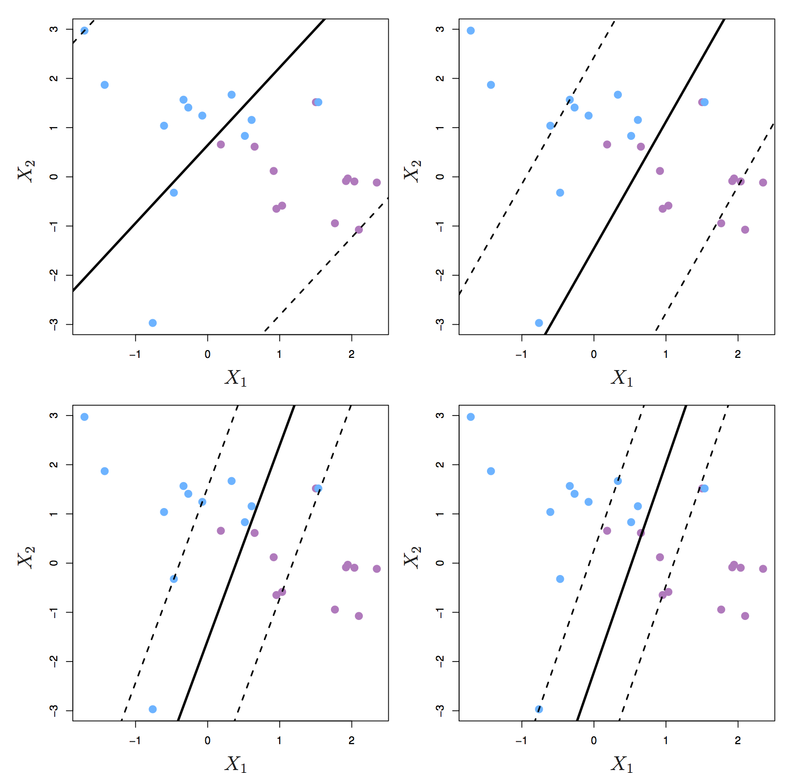
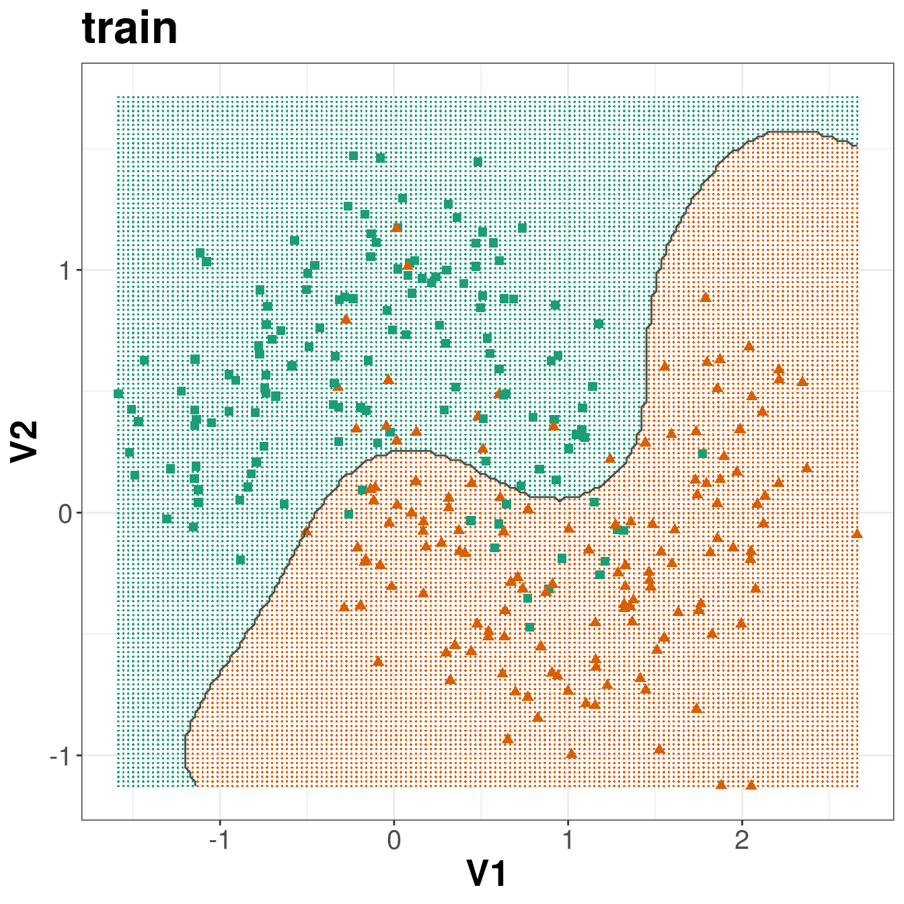
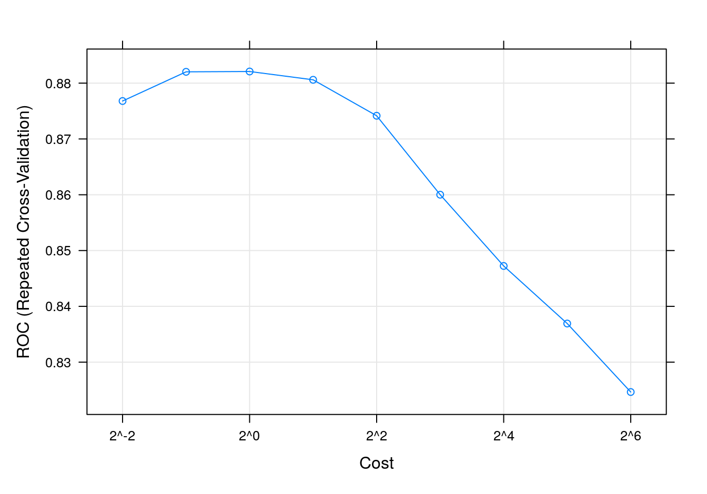
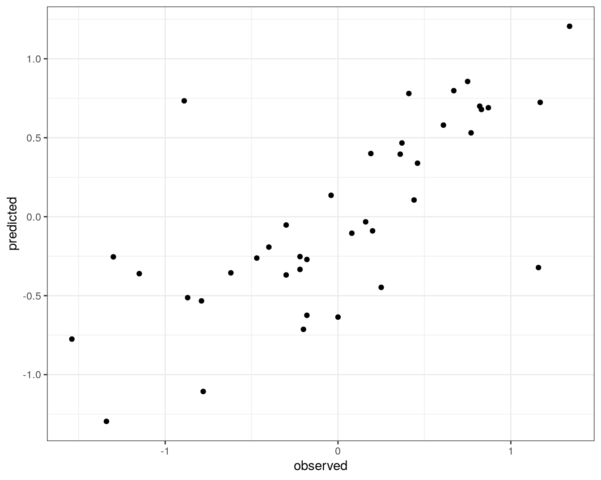

# Support vector machines {#svm}

## Introduction
Support vector machines (SVMs) are models of supervised learning, applicable to both classification and regression problems. The SVM is an extension of the support vector classifier (SVC), which is turn is an extension of the maximum margin classifier. 

### Maximum margin classifier
Let's start by definining a hyperplane. In _p_-dimensional space a hyperplane is a flat affine subspace of _p_-1. Figure \@ref(fig:svmSeparatingHyperplanes2) shows three separating hyperplanes and objects of two different classes. A separating hyperplane forms a natural linear decision boundary, classifying new objects according to which side of the line they are located.

<div class="figure" style="text-align: center">

<p class="caption">(\#fig:svmSeparatingHyperplanes2)Left: two classes of observations (blue, purple) and three separating hyperplanes. Right: separating hyperplane shown as black line and grid indicates decision rule. Source: http://www-bcf.usc.edu/~gareth/ISL/</p>
</div>

If the classes of observations can be separated by a hyperplane, then there will in fact be an infinite number of hyperplanes. So which of the possible hyperplanes do we choose to be our decision boundary? 

The **maximal margin hyperplane** is the separating hyperplane that is farthest from the training observations. The perpendicular distance from a given hyperplane to the nearest training observation is known as the **margin**. The maximal margin hyperplane is the separating hyperplane for which the margin is largest.

<div class="figure" style="text-align: center">

<p class="caption">(\#fig:svmMaximalMarginHyperplane)Maximal margin hyperplane shown as solid line. Margin is the distance from the solid line to either of the dashed lines. The support vectors are the points on the dashed line. Source: http://www-bcf.usc.edu/~gareth/ISL/</p>
</div>

Figure \@ref(fig:svmMaximalMarginHyperplane) shows three training observations that are equidistant from the maximal margin hyperplane and lie on the dashed lines indicating the margin. These are the **support vectors**. If these points were moved slightly, the maximal margin hyperplane would also move, hence the term *support*. The maximal margin hyperplane is set by the **support vectors** alone; it is not influenced by any other observations.

The maximal margin hyperplane is a natural decision boundary, but only if a separating hyperplane exists. In practice there may be non separable cases which prevent the use of the maximal margin classifier.
<div class="figure" style="text-align: center">

<p class="caption">(\#fig:svmNonSeparableCase)The two classes cannot be separated by a hyperplane and so the maximal margin classifier cannot be used. Source: http://www-bcf.usc.edu/~gareth/ISL/</p>
</div>

## Support vector classifier
Even if a separating hyperplane exists, it may not be the best decision boundary. The maximal margin classifier is extremely sensitive to individual observations, so may overfit the training data.

<div class="figure" style="text-align: center">

<p class="caption">(\#fig:svmHyperplaneShift)Left: two classes of observations and a maximum margin hyperplane (solid line). Right: Hyperplane (solid line) moves after the addition of a new observation (original hyperplane is dashed line). Source: http://www-bcf.usc.edu/~gareth/ISL/</p>
</div>


It would be better to choose a classifier based on a hyperplane that:

* is more robust to individual observations
* provides better classification of most of the training variables

In other words, we might tolerate some misclassifications if the prediction of the remaining observations is more reliable. The **support vector classifier** does this by allowing some observations to be on the wrong side of the margin or even on the wrong side of the hyperplane. Observations on the wrong side of the hyperplane are misclassifications.

<div class="figure" style="text-align: center">

<p class="caption">(\#fig:svmObsOnWrongSideHyperplane)Left: observations on the wrong side of the margin. Right: observations on the wrong side of the margin and observations on the wrong side of the hyperplane. Source: http://www-bcf.usc.edu/~gareth/ISL/</p>
</div>

The support vector classifier has a tuning parameter, _C_, that determines the number and severity of the violations to the margin. If _C_ = 0, then no violations to the margin will be tolerated, which is equivalent to the maximal margin classifier. As _C_ increases, the classifier becomes more tolerant of violations to the margin, and so the margin widens.

The optimal value of _C_ is chosen through cross-validation.  

_C_ is described as a tuning parameter, because it controls the bias-variance trade-off:

* a small _C_ results in narrow margins that are rarely violated; the model will have low bias, but high variance.
* as _C_ increases the margins widen allowing more violations; the bias of the model will increase, but its variance will decrease.

The **support vectors** are the observations that lie directly on the margin, or on the wrong side of the margin for their class. The only observations that affect the classifier are the support vectors. As _C_ increases, the margin widens and the number of support vectors increases. In other words, when _C_ increases more observations are involved in determining the decision boundary of the classifier.

<div class="figure" style="text-align: center">

<p class="caption">(\#fig:svmMarginC)Margin of a support vector classifier changing with tuning parameter C. Largest value of C was used in the top left panel, and smaller values in the top right, bottom left and bottom right panels. Source: http://www-bcf.usc.edu/~gareth/ISL/</p>
</div>

## Support Vector Machine
The support vector classifier performs well if we have linearly separable classes, however this isn't always the case.

<div class="figure" style="text-align: center">

<p class="caption">(\#fig:svmNonLinearBoundary)Two classes of observations with a non-linear boundary between them.</p>
</div>

The SVM uses the **kernel trick** to operate in a higher dimensional space, without ever computing the coordinates of the data in that space.

<div class="figure" style="text-align: center">

<p class="caption">(\#fig:svmKernelMachine)Kernel machine. By Alisneaky - Own work, CC0, https://commons.wikimedia.org/w/index.php?curid=14941564</p>
</div>


<div class="figure" style="text-align: center">

<p class="caption">(\#fig:svmPolyAndRadialKernelSVM)Left: SVM with polynomial kernel of degree 3. Right: SVM with radial kernel. Source: http://www-bcf.usc.edu/~gareth/ISL/</p>
</div>


## Example - training a classifier
Training of an SVM will be demonstrated on a 2-dimensional simulated data set, with a non-linear decision boundary.

### Setup environment
Load required libraries

```r
library(caret)
```

```
## Warning in system("timedatectl", intern = TRUE): running command 'timedatectl'
## had status 1
```

```r
library(RColorBrewer)
library(ggplot2)
library(pROC)
library(e1071)
```
### Partition data
Load data

```r
moons <- read.csv("data/sim_data_svm/moons.csv", header=F)
moons$V3=as.factor(moons$V3)
str(moons)
```

```
## 'data.frame':	400 obs. of  3 variables:
##  $ V1: num  -0.496 1.827 1.322 -1.138 -0.21 ...
##  $ V2: num  0.985 -0.501 -0.397 0.192 -0.145 ...
##  $ V3: Factor w/ 2 levels "A","B": 1 2 2 1 2 1 1 2 1 2 ...
```

V1 and V2 are the predictors; V3 is the class. 

Partition data into training and test set

```r
set.seed(42)
trainIndex <- createDataPartition(y=moons$V3, times=1, p=0.7, list=F)
moonsTrain <- moons[trainIndex,]
moonsTest <- moons[-trainIndex,]

summary(moonsTrain$V3)
```

```
##   A   B 
## 140 140
```

```r
summary(moonsTest$V3)
```

```
##  A  B 
## 60 60
```

### Visualize training data


```r
point_shapes <- c(15,17)
bp <- brewer.pal(3,"Dark2")
point_colours <- ifelse(moonsTrain$V3=="A", bp[1], bp[2])
point_shapes <- ifelse(moonsTrain$V3=="A", 15, 17)

point_size = 2

ggplot(moonsTrain, aes(V1,V2)) + 
  geom_point(col=point_colours, shape=point_shapes, 
             size=point_size) + 
  theme_bw() +
  theme(plot.title = element_text(size=25, face="bold"), axis.text=element_text(size=15),
        axis.title=element_text(size=20,face="bold"))
```

<div class="figure" style="text-align: center">

<p class="caption">(\#fig:svmMoonsTrainSet)Scatterplot of the training data</p>
</div>

```r
set.seed(42)
seeds = vector(mode='list',length=101) #this is #folds+1 so 10+1
for (i in 1:100) seeds[[i]] = sample.int(1000,100)
seeds[[101]] = sample.int(1000,1)

trctrl <- trainControl(method = "repeatedcv", 
                       number = 10, 
                       repeats = 10,
                       seeds = seeds,
                       classProbs=TRUE)
svmTune <- train(x = moonsTrain[,c(1:2)],
                 y = moonsTrain[,3],
                 method = "svmRadial",
                 tuneLength = 9,
                 preProc = c("center", "scale"),
                 trControl = trctrl)
                 
svmTune
```

```
## Support Vector Machines with Radial Basis Function Kernel 
## 
## 280 samples
##   2 predictor
##   2 classes: 'A', 'B' 
## 
## Pre-processing: centered (2), scaled (2) 
## Resampling: Cross-Validated (10 fold, repeated 10 times) 
## Summary of sample sizes: 252, 252, 252, 252, 252, 252, ... 
## Resampling results across tuning parameters:
## 
##   C      Accuracy   Kappa    
##    0.25  0.8875000  0.7750000
##    0.50  0.8846429  0.7692857
##    1.00  0.8810714  0.7621429
##    2.00  0.8803571  0.7607143
##    4.00  0.8750000  0.7500000
##    8.00  0.8671429  0.7342857
##   16.00  0.8635714  0.7271429
##   32.00  0.8582143  0.7164286
##   64.00  0.8557143  0.7114286
## 
## Tuning parameter 'sigma' was held constant at a value of 1.36437
## Accuracy was used to select the optimal model using the largest value.
## The final values used for the model were sigma = 1.36437 and C = 0.25.
```

### Prediction performance measures
SVM accuracy profile

Predictions on test set.

```r
svmPred <- predict(svmTune, moonsTest[,c(1:2)])
confusionMatrix(svmPred, as.factor(moonsTest[,3]))
```

```
## Confusion Matrix and Statistics
## 
##           Reference
## Prediction  A  B
##          A 59  7
##          B  1 53
##                                           
##                Accuracy : 0.9333          
##                  95% CI : (0.8729, 0.9708)
##     No Information Rate : 0.5             
##     P-Value [Acc > NIR] : <2e-16          
##                                           
##                   Kappa : 0.8667          
##                                           
##  Mcnemar's Test P-Value : 0.0771          
##                                           
##             Sensitivity : 0.9833          
##             Specificity : 0.8833          
##          Pos Pred Value : 0.8939          
##          Neg Pred Value : 0.9815          
##              Prevalence : 0.5000          
##          Detection Rate : 0.4917          
##    Detection Prevalence : 0.5500          
##       Balanced Accuracy : 0.9333          
##                                           
##        'Positive' Class : A               
## 
```

Get predicted class probabilities so we can build ROC curve.

```r
svmProbs <- predict(svmTune, moonsTest[,c(1:2)], type="prob")
head(svmProbs)
```

```
##            A          B
## 1 0.06967502 0.93032498
## 2 0.93443571 0.06556429
## 3 0.93707422 0.06292578
## 4 0.07198768 0.92801232
## 5 0.88761226 0.11238774
## 6 0.94212490 0.05787510
```

Build a ROC curve.

```r
svmROC <- roc(moonsTest[,3], svmProbs[,"A"])
```

```
## Setting levels: control = A, case = B
```

```
## Setting direction: controls > cases
```

Plot ROC curve.

```r
plot(svmROC, type = "S")
```

<div class="figure" style="text-align: center">

<p class="caption">(\#fig:svmROCcurveMoons)SVM accuracy profile.</p>
</div>
**Sensitivity (true positive rate)**

_TPR = TP/P = TP/(TP+FN)_

**Specificity (true negative rate)**

_SPC = TN/N = TN/(TN+FP)_

Calculate area under ROC curve. 

```r
auc(svmROC)
```

```
## Area under the curve: 0.9728
```

### Plot decision boundary
Create a grid so we can predict across the full range of our variables V1 and V2.


```r
gridSize <- 150 
v1limits <- c(min(moons$V1),max(moons$V1))
tmpV1 <- seq(v1limits[1],v1limits[2],len=gridSize)
v2limits <- c(min(moons$V2), max(moons$V2))
tmpV2 <- seq(v2limits[1],v2limits[2],len=gridSize)
xgrid <- expand.grid(tmpV1,tmpV2)
names(xgrid) <- names(moons)[1:2]
```

Predict values of all elements of grid.

```r
V3 <- as.numeric(predict(svmTune, xgrid))
xgrid <- cbind(xgrid, V3)
```

Plot

```r
point_shapes <- c(15,17)
point_colours <- brewer.pal(3,"Dark2")
point_size = 2

trainClassNumeric <- ifelse(moonsTrain$V3=="A", 1, 2)
testClassNumeric <- ifelse(moonsTest$V3=="A", 1, 2)

ggplot(xgrid, aes(V1,V2)) +
  geom_point(col=point_colours[V3], shape=16, size=0.3) +
  geom_point(data=moonsTrain, aes(V1,V2), col=point_colours[trainClassNumeric],
             shape=point_shapes[trainClassNumeric], size=point_size) +
  geom_contour(data=xgrid, aes(x=V1, y=V2, z=V3), breaks=1.5, col="grey30") +
  ggtitle("train") +
  theme_bw() +
  theme(plot.title = element_text(size=25, face="bold"), axis.text=element_text(size=15),
        axis.title=element_text(size=20,face="bold"))

ggplot(xgrid, aes(V1,V2)) +
  geom_point(col=point_colours[V3], shape=16, size=0.3) +
  geom_point(data=moonsTest, aes(V1,V2), col=point_colours[testClassNumeric],
             shape=point_shapes[testClassNumeric], size=point_size) +
  geom_contour(data=xgrid, aes(x=V1, y=V2, z=V3), breaks=1.5, col="grey30") +
  ggtitle("test") +
  theme_bw() +
  theme(plot.title = element_text(size=25, face="bold"), axis.text=element_text(size=15),
        axis.title=element_text(size=20,face="bold"))
```

<div class="figure" style="text-align: center">

<p class="caption">(\#fig:simDataBinClassDecisionBoundarySVM)Decision boundary created by radial kernel SVM.</p>
</div>

## Defining your own model type to use in caret

Caret has over two hundred built in models, including several support vector machines:
[https://topepo.github.io/caret/available-models.html](https://topepo.github.io/caret/available-models.html)

However, despite this wide range of options, you may occasionally need to define your own model. Caret does not currently have a radial SVM implemented using the [e1071 library](https://cran.r-project.org/package=e1071), so we will define one here.


```r
svmRadialE1071 <- list(
  label = "Support Vector Machines with Radial Kernel - e1071",
  library = "e1071",
  type = c("Regression", "Classification"),
  parameters = data.frame(parameter="cost",
                          class="numeric",
                          label="Cost"),
  grid = function (x, y, len = NULL, search = "grid") 
    {
      if (search == "grid") {
        out <- expand.grid(cost = 2^((1:len) - 3))
      }
      else {
        out <- data.frame(cost = 2^runif(len, min = -5, max = 10))
      }
      out
    },
  loop=NULL,
  fit=function (x, y, wts, param, lev, last, classProbs, ...) 
    {
      if (any(names(list(...)) == "probability") | is.numeric(y)) {
        out <- e1071::svm(x = as.matrix(x), y = y, kernel = "radial", 
                          cost = param$cost, ...)
      }
      else {
        out <- e1071::svm(x = as.matrix(x), y = y, kernel = "radial", 
                          cost = param$cost, probability = classProbs, ...)
      }
      out
    },
  predict = function (modelFit, newdata, submodels = NULL) 
    {
      predict(modelFit, newdata)
    },
  prob = function (modelFit, newdata, submodels = NULL) 
    {
      out <- predict(modelFit, newdata, probability = TRUE)
      attr(out, "probabilities")
    },
  predictors = function (x, ...) 
    {
      out <- if (!is.null(x$terms)) 
        predictors.terms(x$terms)
      else x$xNames
      if (is.null(out)) 
        out <- names(attr(x, "scaling")$x.scale$`scaled:center`)
      if (is.null(out)) 
        out <- NA
      out
    },
  tags = c("Kernel Methods", "Support Vector Machines", "Regression", "Classifier", "Robust Methods"),
  levels = function(x) x$levels,
  sort = function(x)
  {
    x[order(x$cost), ]
  }
)
```

Note that the radial SVM model we have defined has only one tuning parameter, cost (_C_). If we do not define the kernel parameter _gamma_, e1071 will automatically calculate it as 1/(data dimension); _i.e._ if we have 58 predictors, _gamma_ will be 1/58 = 0.01724.

### Model cross-validation and tuning

We will pass the twoClassSummary function into model training through trainControl. Additionally we would like the model to predict class probabilities so that we can calculate the ROC curve, so we use the classProbs option.

```r
cvCtrl <- trainControl(method = "repeatedcv", 
                       repeats = 10,
                       number = 10,
                       summaryFunction = twoClassSummary,
                       classProbs = TRUE,
                       seeds=seeds)
```

We set the **method** of the **train** function to **svmRadial** to specify a radial kernel SVM. In this implementation we only have to tune one parameter, **cost**. The default grid of cost parameters start at 0.25 and double at each iteration. Choosing tuneLength = 9 will give us cost parameters of 0.25, 0.5, 1, 2, 4, 8, 16, 32 and 64. 

```r
svmTune <- train(x = moonsTrain[,c(1:2)],
                 y = moonsTrain[,3],
                 method = svmRadialE1071,
                 tuneLength = 9,
                 preProc = c("center", "scale"),
                 metric = "ROC",
                 trControl = cvCtrl)
                 
svmTune
```

```
## Support Vector Machines with Radial Kernel - e1071 
## 
## 280 samples
##   2 predictor
##   2 classes: 'A', 'B' 
## 
## Pre-processing: centered (2), scaled (2) 
## Resampling: Cross-Validated (10 fold, repeated 10 times) 
## Summary of sample sizes: 252, 252, 252, 252, 252, 252, ... 
## Resampling results across tuning parameters:
## 
##   cost   ROC        Sens       Spec     
##    0.25  0.9230612  0.8378571  0.9057143
##    0.50  0.9320918  0.8592857  0.9057143
##    1.00  0.9418878  0.8692857  0.9000000
##    2.00  0.9455102  0.8792857  0.8964286
##    4.00  0.9479082  0.8785714  0.8914286
##    8.00  0.9485204  0.8678571  0.8857143
##   16.00  0.9492857  0.8757143  0.8800000
##   32.00  0.9490816  0.8764286  0.8728571
##   64.00  0.9463776  0.8778571  0.8707143
## 
## ROC was used to select the optimal model using the largest value.
## The final value used for the model was cost = 16.
```


```r
svmTune$finalModel
```

```
## 
## Call:
## svm.default(x = as.matrix(x), y = y, kernel = "radial", cost = param$cost, 
##     probability = classProbs)
## 
## 
## Parameters:
##    SVM-Type:  C-classification 
##  SVM-Kernel:  radial 
##        cost:  16 
## 
## Number of Support Vectors:  79
```

## Iris example


```r
library(datasets)
data(iris) ##loads the dataset, which can be accessed under the variable name iris
?iris ##opens the documentation for the dataset
summary(iris) ##presents the 5 figure summary of the dataset
```

```
##   Sepal.Length    Sepal.Width     Petal.Length    Petal.Width   
##  Min.   :4.300   Min.   :2.000   Min.   :1.000   Min.   :0.100  
##  1st Qu.:5.100   1st Qu.:2.800   1st Qu.:1.600   1st Qu.:0.300  
##  Median :5.800   Median :3.000   Median :4.350   Median :1.300  
##  Mean   :5.843   Mean   :3.057   Mean   :3.758   Mean   :1.199  
##  3rd Qu.:6.400   3rd Qu.:3.300   3rd Qu.:5.100   3rd Qu.:1.800  
##  Max.   :7.900   Max.   :4.400   Max.   :6.900   Max.   :2.500  
##        Species  
##  setosa    :50  
##  versicolor:50  
##  virginica :50  
##                 
##                 
## 
```

```r
str(iris) ##presents the structure of the iris dataframe
```

```
## 'data.frame':	150 obs. of  5 variables:
##  $ Sepal.Length: num  5.1 4.9 4.7 4.6 5 5.4 4.6 5 4.4 4.9 ...
##  $ Sepal.Width : num  3.5 3 3.2 3.1 3.6 3.9 3.4 3.4 2.9 3.1 ...
##  $ Petal.Length: num  1.4 1.4 1.3 1.5 1.4 1.7 1.4 1.5 1.4 1.5 ...
##  $ Petal.Width : num  0.2 0.2 0.2 0.2 0.2 0.4 0.3 0.2 0.2 0.1 ...
##  $ Species     : Factor w/ 3 levels "setosa","versicolor",..: 1 1 1 1 1 1 1 1 1 1 ...
```


```r
set.seed(42)
trainTestPartition<-createDataPartition(y=iris$Species, #the class label, caret ensures an even split of classes
                                        p=0.7, #proportion of samples assigned to train
                                        list=FALSE)
str(trainTestPartition)
```

```
##  int [1:105, 1] 1 2 3 4 5 7 8 10 11 12 ...
##  - attr(*, "dimnames")=List of 2
##   ..$ : NULL
##   ..$ : chr "Resample1"
```

```r
iris.training <- iris[ trainTestPartition,] #take the corresponding rows for training
iris.testing  <- iris[-trainTestPartition,] #take the corresponding rows for testing by removing training rows
```


```r
set.seed(42)
seeds = vector(mode='list',length=101) #you need length #folds*#repeats + 1 so 10*10 + 1 here
for (i in 1:100) seeds[[i]] = sample.int(1000,10)
seeds[[101]] = sample.int(1000,1)

train_ctrl_seed_repeated = trainControl(method='repeatedcv',
                              number=10, #number of folds
                              repeats=10, #number of times to repeat cross-validation
                              seeds=seeds)
iris_svm <- train(
                  Species ~ .,
                  data = iris.training,
                  method = "svmLinear",
                  parms = list(split = "gini"),
                  preProc = c("corr","nzv","center", "scale","BoxCox"),
                  tuneLength=10,
                  trControl = train_ctrl_seed_repeated
)
iris_svm
```

```
## Support Vector Machines with Linear Kernel 
## 
## 105 samples
##   4 predictor
##   3 classes: 'setosa', 'versicolor', 'virginica' 
## 
## Pre-processing: centered (3), scaled (3), Box-Cox transformation (3), remove (1) 
## Resampling: Cross-Validated (10 fold, repeated 10 times) 
## Summary of sample sizes: 94, 95, 94, 93, 95, 95, ... 
## Resampling results:
## 
##   Accuracy   Kappa    
##   0.9740152  0.9605099
## 
## Tuning parameter 'C' was held constant at a value of 1
```

```r
iris_information_predict_train=predict(iris_svm,iris.training,type='raw')
confusionMatrix(iris_information_predict_train,iris.training$Species)
```

```
## Confusion Matrix and Statistics
## 
##             Reference
## Prediction   setosa versicolor virginica
##   setosa         35          0         0
##   versicolor      0         35         2
##   virginica       0          0        33
## 
## Overall Statistics
##                                           
##                Accuracy : 0.981           
##                  95% CI : (0.9329, 0.9977)
##     No Information Rate : 0.3333          
##     P-Value [Acc > NIR] : < 2.2e-16       
##                                           
##                   Kappa : 0.9714          
##                                           
##  Mcnemar's Test P-Value : NA              
## 
## Statistics by Class:
## 
##                      Class: setosa Class: versicolor Class: virginica
## Sensitivity                 1.0000            1.0000           0.9429
## Specificity                 1.0000            0.9714           1.0000
## Pos Pred Value              1.0000            0.9459           1.0000
## Neg Pred Value              1.0000            1.0000           0.9722
## Prevalence                  0.3333            0.3333           0.3333
## Detection Rate              0.3333            0.3333           0.3143
## Detection Prevalence        0.3333            0.3524           0.3143
## Balanced Accuracy           1.0000            0.9857           0.9714
```

```r
iris_gini_predict=predict(iris_svm,iris.testing,type='raw')
confusionMatrix(iris_gini_predict,iris.testing$Species)
```

```
## Confusion Matrix and Statistics
## 
##             Reference
## Prediction   setosa versicolor virginica
##   setosa         15          0         0
##   versicolor      0         13         2
##   virginica       0          2        13
## 
## Overall Statistics
##                                           
##                Accuracy : 0.9111          
##                  95% CI : (0.7878, 0.9752)
##     No Information Rate : 0.3333          
##     P-Value [Acc > NIR] : 8.467e-16       
##                                           
##                   Kappa : 0.8667          
##                                           
##  Mcnemar's Test P-Value : NA              
## 
## Statistics by Class:
## 
##                      Class: setosa Class: versicolor Class: virginica
## Sensitivity                 1.0000            0.8667           0.8667
## Specificity                 1.0000            0.9333           0.9333
## Pos Pred Value              1.0000            0.8667           0.8667
## Neg Pred Value              1.0000            0.9333           0.9333
## Prevalence                  0.3333            0.3333           0.3333
## Detection Rate              0.3333            0.2889           0.2889
## Detection Prevalence        0.3333            0.3333           0.3333
## Balanced Accuracy           1.0000            0.9000           0.9000
```

## Cell segmentation example

Load required libraries

```r
library(caret)
library(pROC)
library(e1071)
```

Load data

```r
data(segmentationData)
```


```r
segClass <- segmentationData$Class
```

Extract predictors from segmentationData

```r
segData <- segmentationData[,4:59]
```

Partition data

```r
set.seed(42)
trainIndex <- createDataPartition(y=segClass, times=1, p=0.5, list=F)
segDataTrain <- segData[trainIndex,]
segDataTest <- segData[-trainIndex,]
segClassTrain <- segClass[trainIndex]
segClassTest <- segClass[-trainIndex]
```

Set seeds for reproducibility (optional). We will be trying 9 values of the tuning parameter with 5 repeats of 10 fold cross-validation, so we need the following list of seeds.

```r
set.seed(42)
seeds <- vector(mode = "list", length = 51)
for(i in 1:50) seeds[[i]] <- sample.int(1000, 9)
seeds[[51]] <- sample.int(1000,1)
```

We will pass the twoClassSummary function into model training through **trainControl**. Additionally we would like the model to predict class probabilities so that we can calculate the ROC curve, so we use the **classProbs** option. 

```r
cvCtrl <- trainControl(method = "repeatedcv", 
                       repeats = 5,
                       number = 10,
                       summaryFunction = twoClassSummary,
                       classProbs = TRUE,
                       seeds=seeds)
```

Tune SVM over the cost parameter. The default grid of cost parameters start at 0.25 and double at each iteration. Choosing ```tuneLength = 9``` will give us cost parameters of 0.25, 0.5, 1, 2, 4, 8, 16, 32 and 64. The train function will calculate an appropriate value of sigma (the kernel parameter) from the data.

```r
svmTune <- train(x = segDataTrain,
                 y = segClassTrain,
                 method = 'svmRadial',
                 tuneLength = 9,
                 preProc = c("center", "scale"),
                 metric = "ROC",
                 trControl = cvCtrl)

svmTune
```

```
## Support Vector Machines with Radial Basis Function Kernel 
## 
## 1010 samples
##   56 predictor
##    2 classes: 'PS', 'WS' 
## 
## Pre-processing: centered (56), scaled (56) 
## Resampling: Cross-Validated (10 fold, repeated 5 times) 
## Summary of sample sizes: 909, 909, 909, 909, 909, 909, ... 
## Resampling results across tuning parameters:
## 
##   C      ROC        Sens       Spec     
##    0.25  0.8767949  0.8636923  0.6916667
##    0.50  0.8820256  0.8769231  0.6955556
##    1.00  0.8820855  0.8812308  0.7072222
##    2.00  0.8805983  0.8787692  0.7105556
##    4.00  0.8741538  0.8756923  0.6905556
##    8.00  0.8600085  0.8695385  0.6694444
##   16.00  0.8472393  0.8732308  0.6477778
##   32.00  0.8369231  0.8769231  0.6144444
##   64.00  0.8246496  0.8661538  0.6133333
## 
## Tuning parameter 'sigma' was held constant at a value of 0.01598045
## ROC was used to select the optimal model using the largest value.
## The final values used for the model were sigma = 0.01598045 and C = 1.
```


```r
svmTune$finalModel
```

```
## Support Vector Machine object of class "ksvm" 
## 
## SV type: C-svc  (classification) 
##  parameter : cost C = 1 
## 
## Gaussian Radial Basis kernel function. 
##  Hyperparameter : sigma =  0.0159804470403774 
## 
## Number of Support Vectors : 537 
## 
## Objective Function Value : -388.0962 
## Training error : 0.132673 
## Probability model included.
```

SVM accuracy profile

```r
plot(svmTune, metric = "ROC", scales = list(x = list(log =2)))
```

<div class="figure" style="text-align: center">

<p class="caption">(\#fig:svmAccuracyProfileCellSegment)SVM accuracy profile.</p>
</div>

Test set results

```r
svmPred <- predict(svmTune, segDataTest)
confusionMatrix(svmPred, segClassTest)
```

```
## Confusion Matrix and Statistics
## 
##           Reference
## Prediction  PS  WS
##         PS 578 111
##         WS  72 248
##                                           
##                Accuracy : 0.8186          
##                  95% CI : (0.7934, 0.8419)
##     No Information Rate : 0.6442          
##     P-Value [Acc > NIR] : < 2.2e-16       
##                                           
##                   Kappa : 0.5945          
##                                           
##  Mcnemar's Test P-Value : 0.004969        
##                                           
##             Sensitivity : 0.8892          
##             Specificity : 0.6908          
##          Pos Pred Value : 0.8389          
##          Neg Pred Value : 0.7750          
##              Prevalence : 0.6442          
##          Detection Rate : 0.5728          
##    Detection Prevalence : 0.6829          
##       Balanced Accuracy : 0.7900          
##                                           
##        'Positive' Class : PS              
## 
```

Get predicted class probabilities

```r
svmProbs <- predict(svmTune, segDataTest, type="prob")
head(svmProbs)
```

```
##          PS         WS
## 1 0.9015892 0.09841085
## 2 0.9127814 0.08721855
## 3 0.9699164 0.03008361
## 4 0.5828048 0.41719516
## 5 0.8283722 0.17162781
## 6 0.7702593 0.22974067
```

Build a ROC curve

```r
svmROC <- roc(segClassTest, svmProbs[,"PS"])
```

```
## Setting levels: control = PS, case = WS
```

```
## Setting direction: controls > cases
```

```r
auc(svmROC)
```

```
## Area under the curve: 0.8912
```

Plot ROC curve.

```r
plot(svmROC, type = "S")
```

<div class="figure" style="text-align: center">

<p class="caption">(\#fig:svmROCcurveCellSegment)SVM ROC curve for cell segmentation data set.</p>
</div>

Calculate area under ROC curve

```r
auc(svmROC)
```

```
## Area under the curve: 0.8912
```

## Example - regression

This example serves to demonstrate the use of SVMs in regression, but perhaps more importantly, it highlights the power and flexibility of the [caret](http://cran.r-project.org/web/packages/caret/index.html) package. Earlier we used _k_-NN for a regression analysis of the **BloodBrain** dataset (see section 04-nearest-neighbours.Rmd). We will repeat the regression analysis, but this time we will fit a radial kernel SVM. Remarkably, a re-run of this analysis using a completely different type of model, requires changes to only two lines of code.

The pre-processing steps and generation of seeds are identical, therefore if the data were still in memory, we could skip this next block of code:

```r
data(BloodBrain)

set.seed(42)
trainIndex <- createDataPartition(y=logBBB, times=1, p=0.8, list=F)
descrTrain <- bbbDescr[trainIndex,]
concRatioTrain <- logBBB[trainIndex]
descrTest <- bbbDescr[-trainIndex,]
concRatioTest <- logBBB[-trainIndex]

transformations <- preProcess(descrTrain,
                              method=c("center", "scale", "corr", "nzv"),
                              cutoff=0.75)
descrTrain <- predict(transformations, descrTrain)

set.seed(42)
seeds <- vector(mode = "list", length = 26)
for(i in 1:25) seeds[[i]] <- sample.int(1000, 50)
seeds[[26]] <- sample.int(1000,1)
```

In the arguments to the ```train``` function we change ```method``` from ```knn``` to ```svmRadialE1071```. The ```tunegrid``` parameter is replaced with ```tuneLength = 9```. Now we are ready to fit an SVM model.

```r
svmTune2 <- train(descrTrain,
                 concRatioTrain,
                 method=svmRadialE1071,
                 tuneLength = 9,
                 trControl = trainControl(method="repeatedcv",
                                          number = 5,
                                          repeats = 5,
                                          seeds=seeds
                                          )
)

svmTune2
```

```
## Support Vector Machines with Radial Kernel - e1071 
## 
## 168 samples
##  63 predictor
## 
## No pre-processing
## Resampling: Cross-Validated (5 fold, repeated 5 times) 
## Summary of sample sizes: 136, 134, 134, 134, 134, 134, ... 
## Resampling results across tuning parameters:
## 
##   cost   RMSE       Rsquared   MAE      
##    0.25  0.6161239  0.4980242  0.4610789
##    0.50  0.5734394  0.5332846  0.4316062
##    1.00  0.5465607  0.5505891  0.4178574
##    2.00  0.5300490  0.5661867  0.4035017
##    4.00  0.5248272  0.5712901  0.3985361
##    8.00  0.5244977  0.5718310  0.3980940
##   16.00  0.5244977  0.5718310  0.3980940
##   32.00  0.5244977  0.5718310  0.3980940
##   64.00  0.5244977  0.5718310  0.3980940
## 
## RMSE was used to select the optimal model using the smallest value.
## The final value used for the model was cost = 8.
```


```r
plot(svmTune2)
```

<div class="figure" style="text-align: center">

<p class="caption">(\#fig:rmseCorSVM)Root Mean Squared Error as a function of cost.</p>
</div>

Use model to predict outcomes, after first pre-processing the test set.

```r
descrTest <- predict(transformations, descrTest)
test_pred <- predict(svmTune2, descrTest)
```

Prediction performance can be visualized in a scatterplot.

```r
qplot(concRatioTest, test_pred) + 
  xlab("observed") +
  ylab("predicted") +
  theme_bw()
```

<div class="figure" style="text-align: center">

<p class="caption">(\#fig:obsPredConcRatiosSVM)Concordance between observed concentration ratios and those predicted by radial kernel SVM.</p>
</div>

We can also measure correlation between observed and predicted values.

```r
cor(concRatioTest, test_pred)
```

```
## [1] 0.7274762
```


## Further reading
[An Introduction to Statistical Learning](http://www-bcf.usc.edu/~gareth/ISL/)
