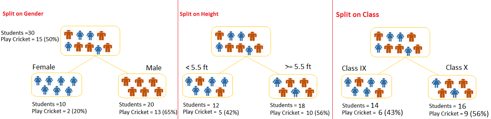
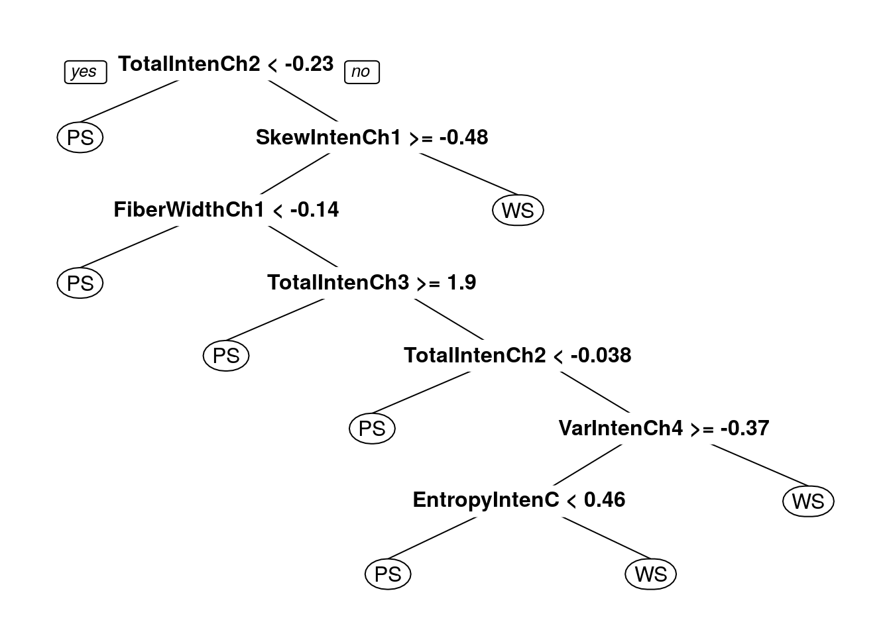
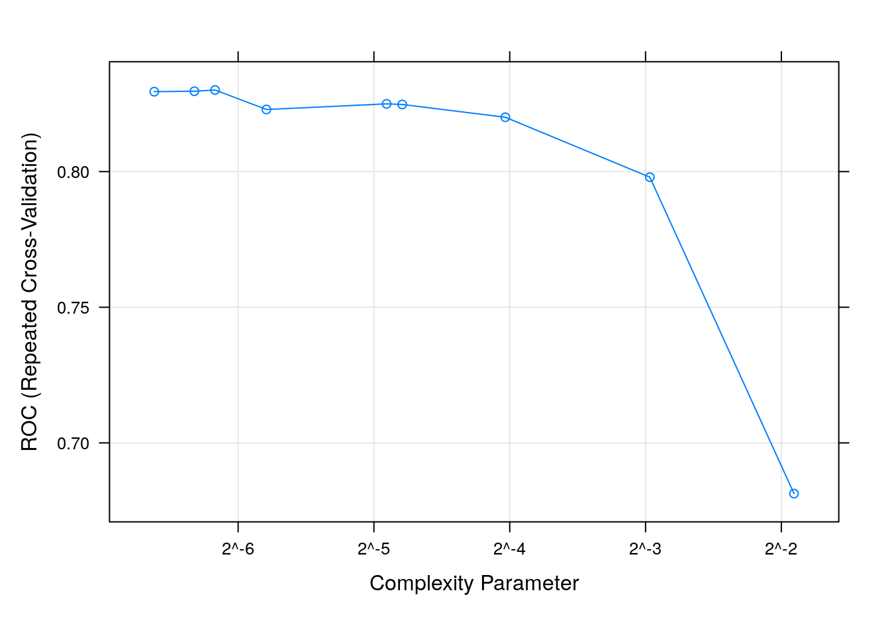
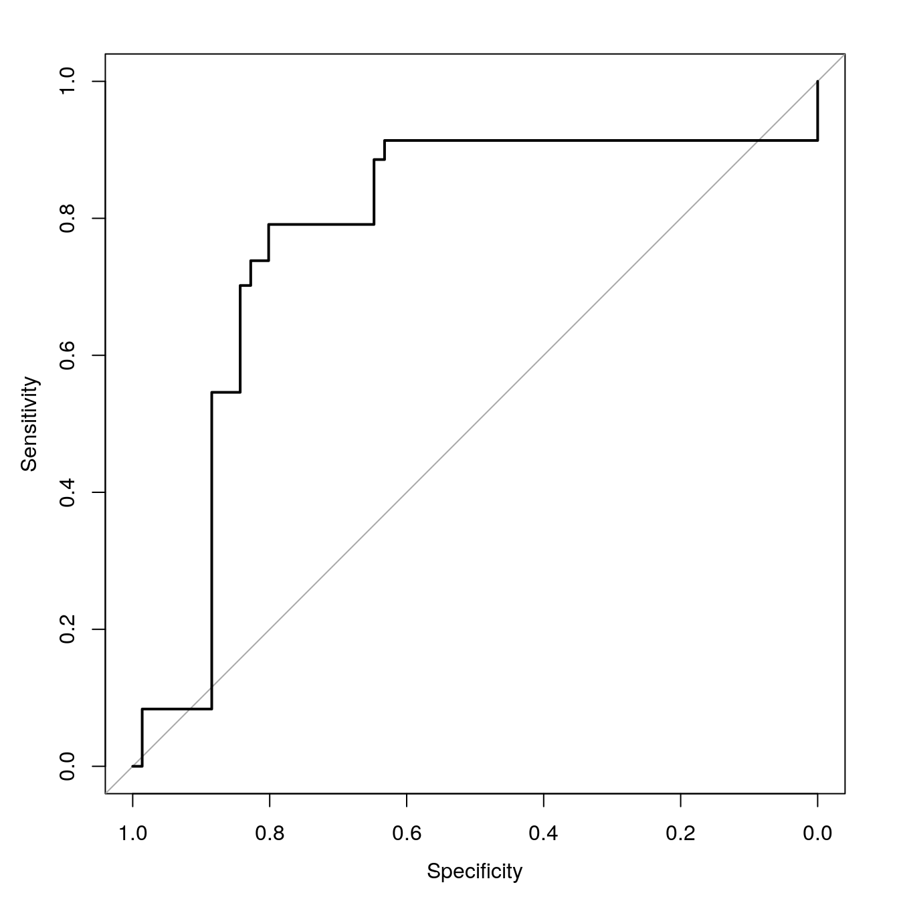
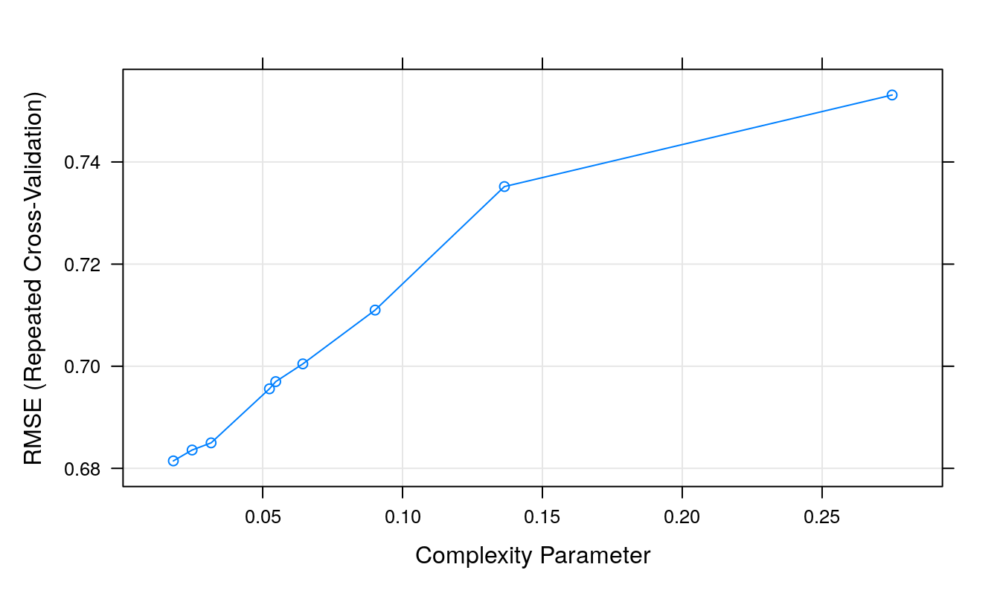
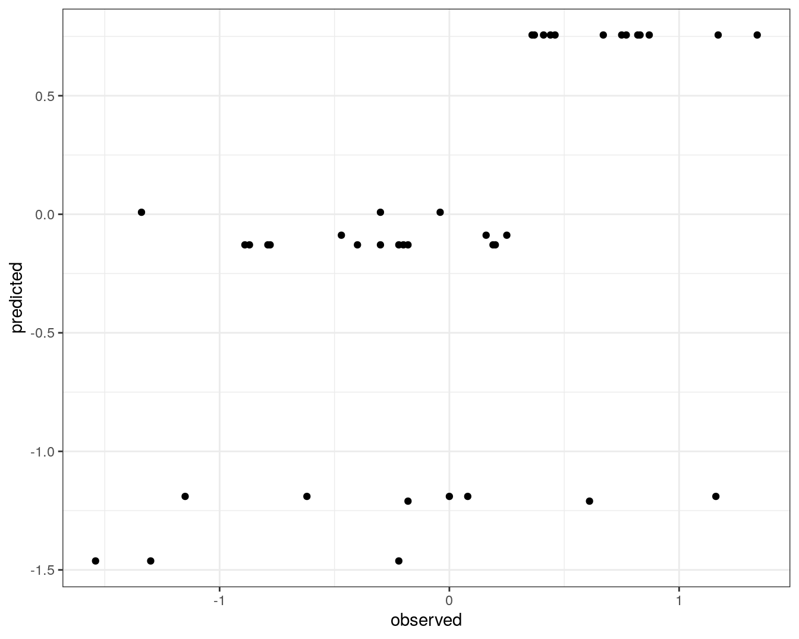
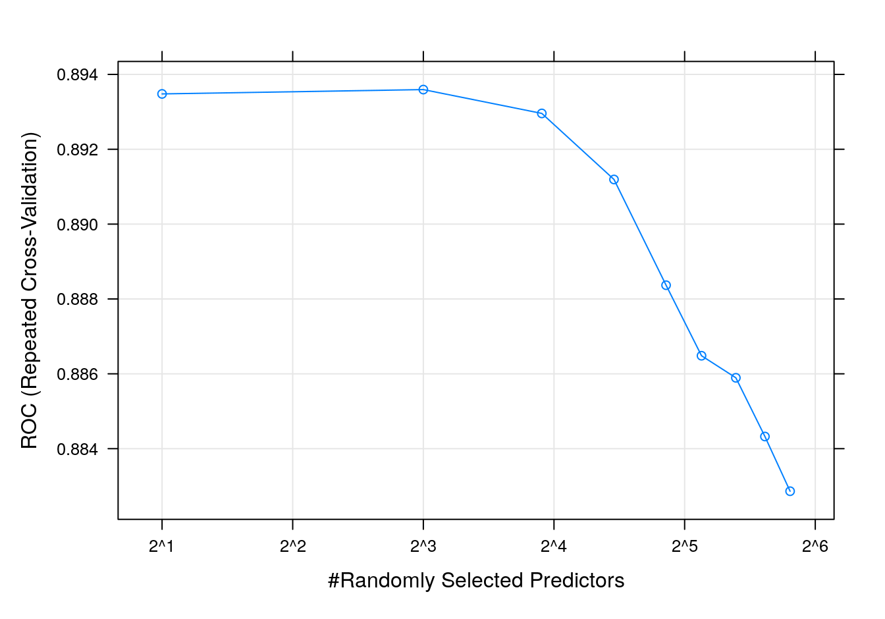
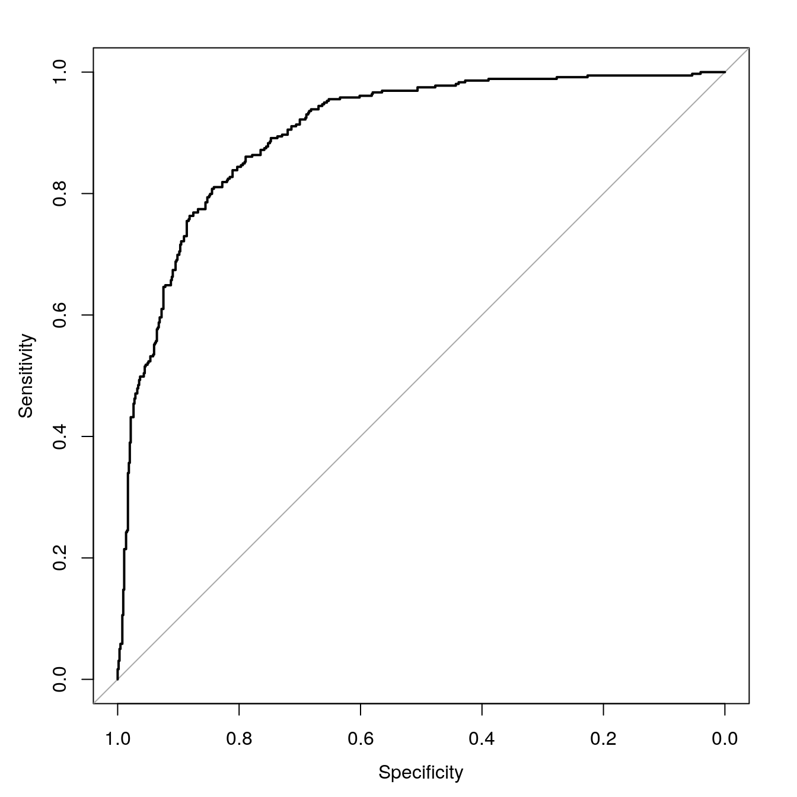
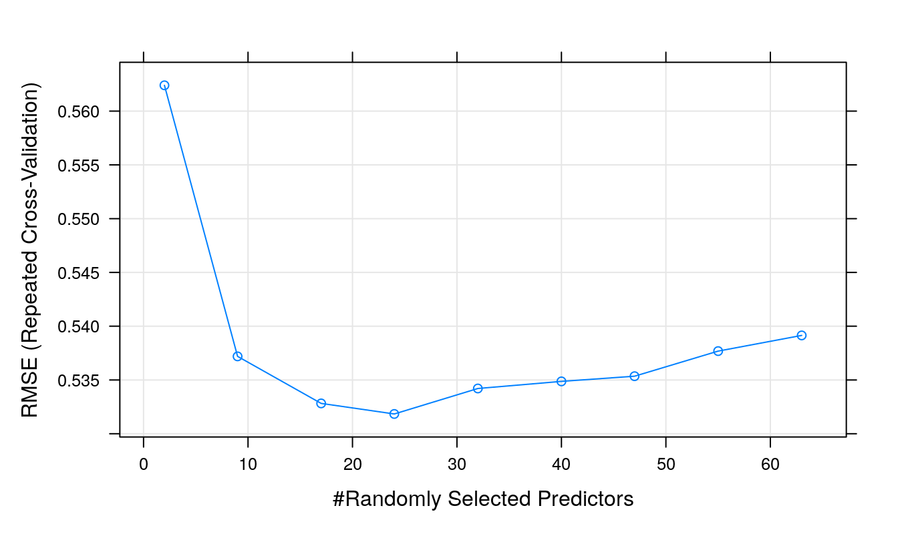
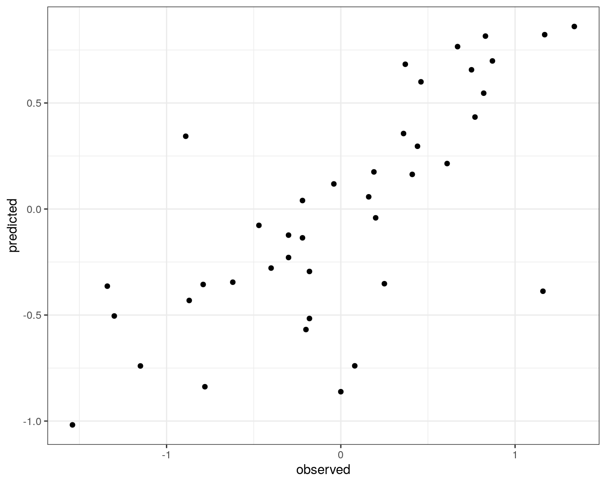

# Decision trees and random forests {#decision-trees}

<!-- Sudhakaran -->
## Decision Trees

**What is a Decision Tree?**

Decision tree or recursive partitioning is a supervised graph based algorithm to represent choices and the results of the choices in the form of a tree. 

The nodes in the graph represent an event or choice and it is referred to as a **leaf** and the set of *decisions* made at the node is reffered to as **branches**. 

Decision trees map non-linear relationships and the hierarchical leaves and branches makes a **Tree**. 

It is one of the most widely used tool in ML for predictive analytics. Examples of use of decision tress are − predicting an email as spam or not spam, predicting whether a tumor is cancerous or not.

<div class="figure" style="text-align: center">

<p class="caption">(\#fig:unnamed-chunk-1)Decision Tree</p>
</div>

*Image source: analyticsvidhya.com*

**How does it work?**

A model is first created with training data and then a set of validation data is used to verify and improve the model. R has many packages, such as ctree, rpart, tree, and so on, which are used to create and visualize decision trees. 

<div class="figure" style="text-align: center">

<p class="caption">(\#fig:unnamed-chunk-2)Example of a decision Tree</p>
</div>

*Image source: analyticsvidhya.com* 

**Example of a decision tree**\
In this problem (Figure 6.2), we need to segregate students who play cricket in their leisure time based on highly significant input variable among all three.

The decision tree algorithm will initially segregate the students based on **all values** of three variable (Gender, Class, and Height) and identify the variable, which creates the best homogeneous sets of students (which are heterogeneous to each other).

In the snapshot above, you can see that variable Gender is able to identify best homogeneous sets compared to the other two variables.

There are a number of decision tree algorithms. We have to choose them based on our dataset. If the dependent variable is categorical, then we have to use a *categorical variable decision tree*. If the dependent variable is continuous, then we have to use a *continuous variable decision tree*. 

The above example is of the categorical variable decision tree type. 

**Some simple R code for a decision tree looks like this:**

<!-- this chunk will not run because we have not defined any data-->


```r
library(rpart)
x <- cbind(x_train,y_train) ##y_train – represents dependent variable, x_train – represents independent variable
# grow tree 
fit <- rpart(y_train ~ ., data = x,method="class") ##x – represents training data
summary(fit)
#Predict Output 
predicted <- predict(fit,x_test)
```

**Terminology related to decision trees**

*Root nodule*: the entire population that can get further divided into homogeneous sets

*Splitting*: process of diving a node into two or more sub-nodes

*Decision node*: When a sub-node splits into further sub-nodes

*Leaf or terminal node*: when a node does not split further it is called a terminal node. 

*Pruning*: A loose stopping crieteria is used to contruct the tree and then the tree is cut back by removing branches that do not contribute to the generalisation accuracy. 

*Branch*: a sub-section of an entire tree

**How does a tree decide where to split?**

The classification tree searches through each dependent variable to find a single variable that splits the data into two or more groups and this process is repeated until the stopping criteria is invoked. 

The decision of making strategic splits heavily affects a tree’s accuracy. The decision criteria is different for classification and regression trees.

Decision trees use multiple algorithms to decide to split a node in two or more sub-nodes. The common goal for these algorithms is the creation of sub-nodes with increased homogeneity. In other words, we can say that purity of the node increases with respect to the target variable. Decision tree splits the nodes on all available variables and then selects the split which results in most homogeneous sub-nodes.

**Commonly used algorithms to decide where to split**

**Gini Index**\
If we select two items from a population at random then they must be of same class and the probability for this is 1 if population is pure.

a. It works with categorical target variable “Success” or “Failure”.\
b. It performs only Binary splits\
c. Higher the value of Gini higher the homogeneity.\
d. CART (Classification and Regression Tree) uses Gini method to create binary splits.

Step 1: Calculate Gini for sub-nodes, using formula sum of square of probability for success and failure \ $$p^2+q^2$$.
Step 2: Calculate Gini for split using weighted Gini score of each node of that split.

**Chi-Square**\
It is an algorithm to find out the statistical significance between the differences between sub-nodes and parent node. We measure it by sum of squares of standardized differences between observed and expected frequencies of target variable.

a. It works with categorical target variable “Success” or “Failure”.
b. It can perform two or more splits.
c. Higher the value of Chi-Square higher the statistical significance of differences between sub-node and Parent node.
d. Chi-Square of each node is calculated using formula,
Chi-square = $$\sum(Actual – Expected)^2 / Expected$$

Steps to Calculate Chi-square for a split:

1. Calculate Chi-square for individual node by calculating the deviation for Success and Failure both
2. Calculated Chi-square of Split using Sum of all Chi-square of success and Failure of each node of the split

**Information Gain**\
The more homogeneous something is the less information is needed to describe it and hence it has gained information. Information theory has a measure to define this degree of disorganization in a system and it is known as Entropy. If a sample is completely homogeneous, then the entropy is zero and if it is equally divided (50% – 50%), it has entropy of one.

Entropy can be calculated using formula
$$Entropy = -plog_2p - qlog_2q$$

Where p and q are probability of success and failure

**Reduction in Variance**

Reduction in variance is an algorithm used for continuous target variables (regression problems). This algorithm uses the standard formula of variance to choose the best split. The split with lower variance is selected as the criteria to split the population:

**Advantages of decision tree**

1. Simple to understand and use\
2. Algorithms are robust to noisy data\
3. Useful in data exploration\
4. decision tree is 'non parametric' in nature i.e. does not have any assumptions about the distribution of the variables

**Disadvantages of decision tree** 

1.Overfitting is the common disadvantage of decision trees. It is taken care of partially by constraining the model parameter and by pruning.\
2. It is not ideal for continuous variables as in it looses information

*Some parameters used to defining a tree and constrain overfitting*

1. Minimum sample for a node split\
2. Minimum sample for a terminal node\
3. Maximum depth of a tree\
4. Maximum number of terminal nodes\
5. Maximum features considered for split

*Acknowledgement: some aspects of this explanation can be read from www.analyticsvidhya.com*

## Example code with categorical data

We are going to plot a car evaluation data with 7 attributes, 6 as feature attributes and 1 as the target attribute. This is to evaluate what kinds of cars people purchase. All the attributes are categorical. We will try to build a classifier for predicting the Class attribute. The index of target attribute is 7th. For more information about this dataset, see https://archive.ics.uci.edu/ml/datasets/car+evaluation

### Loading packages and data

R package *caret* helps to perform various machine learning tasks including decision tree classification. The *rplot.plot* package will help to get a visual plot of the decision tree.


```r
library(caret)
```

```
## Warning in system("timedatectl", intern = TRUE): running command 'timedatectl'
## had status 1
```

```r
library(rpart.plot)
#download.file(url = "https://archive.ics.uci.edu/ml/machine-learning-databases/car/car.data",
#              destfile = "data/car.data")
car.data <- read.csv("data/Decision_tree_and_RF/car.data", sep = ',', header = FALSE)
colnames(car.data)=c('buying','maint','doors','persons','lug_boot','safety','class')
```


```r
str(car.data) 
```

```
## 'data.frame':	1728 obs. of  7 variables:
##  $ buying  : chr  "vhigh" "vhigh" "vhigh" "vhigh" ...
##  $ maint   : chr  "vhigh" "vhigh" "vhigh" "vhigh" ...
##  $ doors   : chr  "2" "2" "2" "2" ...
##  $ persons : chr  "2" "2" "2" "2" ...
##  $ lug_boot: chr  "small" "small" "small" "med" ...
##  $ safety  : chr  "low" "med" "high" "low" ...
##  $ class   : chr  "unacc" "unacc" "unacc" "unacc" ...
```

```r
head(car.data)
```

```
##   buying maint doors persons lug_boot safety class
## 1  vhigh vhigh     2       2    small    low unacc
## 2  vhigh vhigh     2       2    small    med unacc
## 3  vhigh vhigh     2       2    small   high unacc
## 4  vhigh vhigh     2       2      med    low unacc
## 5  vhigh vhigh     2       2      med    med unacc
## 6  vhigh vhigh     2       2      med   high unacc
```

The output of this will show us that our dataset consists of 1728 observations each with 7 attributes and that all the features are categorical, so normalization of data is not needed.

### Data Slicing

Data slicing is a step to split data into train and test set. Training data set can be used specifically for our model building. Test dataset should not be mixed up while building model. Even during standardization, we should not standardize our test set.


```r
set.seed(42)
trainTestPartition <- createDataPartition(y = car.data$class, p= 0.7, list = FALSE)
car.training <- car.data[trainTestPartition,]
car.testing <- car.data[-trainTestPartition,]
```

The “p” parameter holds a decimal value in the range of 0-1. It’s to show that percentage of the split. We are using p=0.7. It means that data split should be done in 70:30 ratio.

### Data Preprocessing

First, check the dimensions of the data.


```r
dim(car.training); dim(car.testing);
```

```
## [1] 1211    7
```

```
## [1] 517   7
```

Next, check for missing data.


```r
anyNA(car.data)
```

```
## [1] FALSE
```

Make sure none of the variables are zero or near-zero variance.


```r
nzv(car.data)
```

```
## integer(0)
```

### Training Decisions Trees


```r
set.seed(42)
seeds = vector(mode='list',length=101)
for (i in 1:100) seeds[[i]] = sample.int(1000,100)
seeds[[101]] = sample.int(1000,1)

trctrl <- trainControl(method = "repeatedcv", 
                       number = 10, 
                       repeats = 10,
                       seeds = seeds)
```

Training the Decision Tree classifier with criterion as GINI INDEX


```r
dtree_fit <- train(class ~., data = car.training, method = "rpart",
                   parms = list(split = "gini"),
                   trControl=trctrl,
                   tuneLength = 10)
dtree_fit
```

```
## CART 
## 
## 1211 samples
##    6 predictor
##    4 classes: 'acc', 'good', 'unacc', 'vgood' 
## 
## No pre-processing
## Resampling: Cross-Validated (10 fold, repeated 10 times) 
## Summary of sample sizes: 1090, 1090, 1092, 1089, 1090, 1089, ... 
## Resampling results across tuning parameters:
## 
##   cp           Accuracy   Kappa    
##   0.006868132  0.8561955  0.6905404
##   0.008241758  0.8533826  0.6840524
##   0.009615385  0.8517310  0.6780120
##   0.012362637  0.8424055  0.6518579
##   0.013736264  0.8387772  0.6442497
##   0.016483516  0.8282234  0.6206633
##   0.019230769  0.8208613  0.6059427
##   0.024725275  0.8072310  0.5764531
##   0.052197802  0.7977251  0.5671482
##   0.072802198  0.7512436  0.3541499
## 
## Accuracy was used to select the optimal model using the largest value.
## The final value used for the model was cp = 0.006868132.
```
Training the Decision Tree classifier with criterion as INFORMATION GAIN


```r
dtree_fit_information <- train(class ~., data = car.training, method = "rpart",
                               parms = list(split = "information"),
                               trControl=trctrl,
                               tuneLength = 10)
dtree_fit_information
```

```
## CART 
## 
## 1211 samples
##    6 predictor
##    4 classes: 'acc', 'good', 'unacc', 'vgood' 
## 
## No pre-processing
## Resampling: Cross-Validated (10 fold, repeated 10 times) 
## Summary of sample sizes: 1091, 1091, 1090, 1090, 1089, 1090, ... 
## Resampling results across tuning parameters:
## 
##   cp           Accuracy   Kappa    
##   0.006868132  0.8538494  0.6879006
##   0.008241758  0.8537695  0.6860030
##   0.009615385  0.8529559  0.6831290
##   0.012362637  0.8359565  0.6411485
##   0.013736264  0.8294294  0.6264449
##   0.016483516  0.8252267  0.6172837
##   0.019230769  0.8179598  0.6014662
##   0.024725275  0.7972610  0.5351600
##   0.052197802  0.7738585  0.4786880
##   0.072802198  0.7330169  0.2661896
## 
## Accuracy was used to select the optimal model using the largest value.
## The final value used for the model was cp = 0.006868132.
```

In both cases, the same cp value is chosen but we see different accuracy and kappa values.

### Plotting the decision trees


```r
prp(dtree_fit$finalModel, box.palette = "Reds", tweak = 1.2) ##Gini tree
```


```r
prp(dtree_fit_information$finalModel, box.palette = "Blues", tweak = 1.2) ##Information tree
```


We also see different trees from the two *split* parameters.

### Prediction

The model is trained with cp = 0.006868132. cp is the complexity parameter for our dtree. We are ready to predict classes for our test set. We can use predict() method. Let’s try to predict target variable for test set’s 1st record.


```r
car.testing[1,]
```

```
##   buying maint doors persons lug_boot safety class
## 2  vhigh vhigh     2       2    small    med unacc
```

```r
predict(dtree_fit, newdata = car.testing[1,])
```

```
## [1] unacc
## Levels: acc good unacc vgood
```

```r
predict(dtree_fit_information, newdata = car.testing[1,])
```

```
## [1] unacc
## Levels: acc good unacc vgood
```

In both models, the 1st record is predicted as unacc. Now, we predict target variable for the whole test set.


```r
test_pred <- predict(dtree_fit, newdata = car.testing)
confusionMatrix(test_pred, as.factor(car.testing$class) )
```

```
## Confusion Matrix and Statistics
## 
##           Reference
## Prediction acc good unacc vgood
##      acc    80    8    20     8
##      good    6    4     2     0
##      unacc  22    1   341     0
##      vgood   7    7     0    11
## 
## Overall Statistics
##                                           
##                Accuracy : 0.8433          
##                  95% CI : (0.8091, 0.8736)
##     No Information Rate : 0.7021          
##     P-Value [Acc > NIR] : 6.824e-14       
##                                           
##                   Kappa : 0.6542          
##                                           
##  Mcnemar's Test P-Value : NA              
## 
## Statistics by Class:
## 
##                      Class: acc Class: good Class: unacc Class: vgood
## Sensitivity              0.6957    0.200000       0.9394      0.57895
## Specificity              0.9104    0.983903       0.8506      0.97189
## Pos Pred Value           0.6897    0.333333       0.9368      0.44000
## Neg Pred Value           0.9127    0.968317       0.8562      0.98374
## Prevalence               0.2224    0.038685       0.7021      0.03675
## Detection Rate           0.1547    0.007737       0.6596      0.02128
## Detection Prevalence     0.2244    0.023211       0.7041      0.04836
## Balanced Accuracy        0.8030    0.591952       0.8950      0.77542
```

```r
test_pred_information <- predict(dtree_fit_information, newdata = car.testing)
confusionMatrix(test_pred_information, as.factor(car.testing$class) )
```

```
## Confusion Matrix and Statistics
## 
##           Reference
## Prediction acc good unacc vgood
##      acc    88    6    26     8
##      good    6    6     2     0
##      unacc  17    1   335     0
##      vgood   4    7     0    11
## 
## Overall Statistics
##                                           
##                Accuracy : 0.8511          
##                  95% CI : (0.8174, 0.8806)
##     No Information Rate : 0.7021          
##     P-Value [Acc > NIR] : 2.18e-15        
##                                           
##                   Kappa : 0.6783          
##                                           
##  Mcnemar's Test P-Value : NA              
## 
## Statistics by Class:
## 
##                      Class: acc Class: good Class: unacc Class: vgood
## Sensitivity              0.7652     0.30000       0.9229      0.57895
## Specificity              0.9005     0.98390       0.8831      0.97791
## Pos Pred Value           0.6875     0.42857       0.9490      0.50000
## Neg Pred Value           0.9306     0.97217       0.8293      0.98384
## Prevalence               0.2224     0.03868       0.7021      0.03675
## Detection Rate           0.1702     0.01161       0.6480      0.02128
## Detection Prevalence     0.2476     0.02708       0.6828      0.04255
## Balanced Accuracy        0.8329     0.64195       0.9030      0.77843
```

Although the 1st record was predicted the same in the Gini and information versions of the decision tree model, we see differences across the testing set.

### Implementing Decision Trees directly

Both *rpart* and *C.50* are widely-used packages for Decision Trees. If you want to use the packages directly then you can implement them like this:

**rpart**


```r
rpart_dtree=rpart(class~.,
                  car.training,
                  parms = list(split="gini"),
                  cp=0.006868132)
prp(rpart_dtree,box.palette = 'Reds',tweak=1.2)
```


```r
rpart_test_pred <- predict(rpart_dtree, newdata = car.testing,type = 'class')
confusionMatrix(rpart_test_pred, as.factor(car.testing$class) )
```

```
## Confusion Matrix and Statistics
## 
##           Reference
## Prediction acc good unacc vgood
##      acc   109    0    11     6
##      good    3   16     0     0
##      unacc   2    0   352     0
##      vgood   1    4     0    13
## 
## Overall Statistics
##                                           
##                Accuracy : 0.9478          
##                  95% CI : (0.9249, 0.9653)
##     No Information Rate : 0.7021          
##     P-Value [Acc > NIR] : < 2.2e-16       
##                                           
##                   Kappa : 0.887           
##                                           
##  Mcnemar's Test P-Value : NA              
## 
## Statistics by Class:
## 
##                      Class: acc Class: good Class: unacc Class: vgood
## Sensitivity              0.9478     0.80000       0.9697      0.68421
## Specificity              0.9577     0.99396       0.9870      0.98996
## Pos Pred Value           0.8651     0.84211       0.9944      0.72222
## Neg Pred Value           0.9847     0.99197       0.9325      0.98798
## Prevalence               0.2224     0.03868       0.7021      0.03675
## Detection Rate           0.2108     0.03095       0.6809      0.02515
## Detection Prevalence     0.2437     0.03675       0.6847      0.03482
## Balanced Accuracy        0.9528     0.89698       0.9784      0.83709
```


```r
rpart_dtree_information=rpart(class~.,
                              car.training,
                              parms = list(split="information"),
                              cp=0.005494505)
prp(rpart_dtree_information,box.palette = 'Blues',tweak=1.2)
```


```r
rpart_test_pred_information <- predict(rpart_dtree_information, newdata = car.testing,type = 'class')
confusionMatrix(rpart_test_pred_information, as.factor(car.testing$class) )
```

```
## Confusion Matrix and Statistics
## 
##           Reference
## Prediction acc good unacc vgood
##      acc   108    4     8     6
##      good    1   12     0     0
##      unacc   5    0   355     0
##      vgood   1    4     0    13
## 
## Overall Statistics
##                                           
##                Accuracy : 0.9439          
##                  95% CI : (0.9204, 0.9621)
##     No Information Rate : 0.7021          
##     P-Value [Acc > NIR] : < 2.2e-16       
##                                           
##                   Kappa : 0.8766          
##                                           
##  Mcnemar's Test P-Value : NA              
## 
## Statistics by Class:
## 
##                      Class: acc Class: good Class: unacc Class: vgood
## Sensitivity              0.9391     0.60000       0.9780      0.68421
## Specificity              0.9552     0.99799       0.9675      0.98996
## Pos Pred Value           0.8571     0.92308       0.9861      0.72222
## Neg Pred Value           0.9821     0.98413       0.9490      0.98798
## Prevalence               0.2224     0.03868       0.7021      0.03675
## Detection Rate           0.2089     0.02321       0.6867      0.02515
## Detection Prevalence     0.2437     0.02515       0.6963      0.03482
## Balanced Accuracy        0.9472     0.79899       0.9727      0.83709
```

**C.50**


```r
library(C50)
car.training.factors= as.data.frame(lapply(car.training,as.factor))
car.testing.factors= as.data.frame(lapply(car.testing,as.factor))
c50_dtree <- C5.0(x = car.training.factors[, 1:6], y = car.training.factors$class)
summary(c50_dtree)
```

```
## 
## Call:
## C5.0.default(x = car.training.factors[, 1:6], y = car.training.factors$class)
## 
## 
## C5.0 [Release 2.07 GPL Edition]  	Fri Jul  1 10:00:00 2022
## -------------------------------
## 
## Class specified by attribute `outcome'
## 
## Read 1211 cases (7 attributes) from undefined.data
## 
## Decision tree:
## 
## persons = 2: unacc (409)
## persons in {4,more}:
## :...safety = low: unacc (261)
##     safety in {high,med}:
##     :...buying in {low,med}:
##         :...maint in {high,vhigh}:
##         :   :...lug_boot = big:
##         :   :   :...buying = med: acc (23)
##         :   :   :   buying = low:
##         :   :   :   :...safety = med: acc (12)
##         :   :   :       safety = high:
##         :   :   :       :...maint = high: vgood (6)
##         :   :   :           maint = vhigh: acc (6)
##         :   :   lug_boot in {med,small}:
##         :   :   :...safety = high: acc (41/4)
##         :   :       safety = med:
##         :   :       :...lug_boot = med:
##         :   :           :...doors = 2: unacc (6/1)
##         :   :           :   doors in {4,5more}: acc (13)
##         :   :           :   doors = 3:
##         :   :           :   :...persons = 4: unacc (3/1)
##         :   :           :       persons = more: acc (4)
##         :   :           lug_boot = small:
##         :   :           :...buying = med: unacc (13)
##         :   :               buying = low:
##         :   :               :...maint = high: acc (5)
##         :   :                   maint = vhigh: unacc (6)
##         :   maint in {low,med}:
##         :   :...safety = med:
##         :       :...lug_boot = small:
##         :       :   :...doors in {3,4,5more}: acc (15)
##         :       :   :   doors = 2:
##         :       :   :   :...persons = 4: acc (3)
##         :       :   :       persons = more: unacc (4)
##         :       :   lug_boot in {big,med}:
##         :       :   :...maint = med:
##         :       :       :...buying = low: good (14/3)
##         :       :       :   buying = med: acc (11)
##         :       :       maint = low:
##         :       :       :...lug_boot = big: good (12)
##         :       :           lug_boot = med:
##         :       :           :...doors in {2,3}: acc (6/1)
##         :       :               doors in {4,5more}: good (7)
##         :       safety = high:
##         :       :...lug_boot = small:
##         :           :...doors = 2:
##         :           :   :...persons = 4: acc (2/1)
##         :           :   :   persons = more: unacc (4)
##         :           :   doors in {3,4,5more}:
##         :           :   :...buying = low: good (9)
##         :           :       buying = med:
##         :           :       :...maint = low: good (3)
##         :           :           maint = med: acc (4)
##         :           lug_boot in {big,med}:
##         :           :...lug_boot = big: vgood (23)
##         :               lug_boot = med:
##         :               :...doors = 2:
##         :                   :...buying = low: good (2)
##         :                   :   buying = med: acc (3/1)
##         :                   doors in {3,4,5more}:
##         :                   :...persons = more: vgood (11)
##         :                       persons = 4:
##         :                       :...doors = 3: good (2)
##         :                           doors in {4,5more}: vgood (5)
##         buying in {high,vhigh}:
##         :...maint = vhigh: unacc (65)
##             maint in {high,low,med}:
##             :...lug_boot = small:
##                 :...safety = med: unacc (32)
##                 :   safety = high:
##                 :   :...maint in {low,med}: acc (19/3)
##                 :       maint = high:
##                 :       :...buying = high: acc (5/1)
##                 :           buying = vhigh: unacc (5)
##                 lug_boot in {big,med}:
##                 :...maint = high:
##                     :...buying = high: acc (25/3)
##                     :   buying = vhigh: unacc (23)
##                     maint in {low,med}:
##                     :...lug_boot = big: acc (47)
##                         lug_boot = med:
##                         :...safety = high: acc (20)
##                             safety = med:
##                             :...doors in {4,5more}: acc (10)
##                                 doors in {2,3}:
##                                 :...persons = 4: unacc (6)
##                                     persons = more:
##                                     :...doors = 2: unacc (2)
##                                         doors = 3: acc (4)
## 
## 
## Evaluation on training data (1211 cases):
## 
## 	    Decision Tree   
## 	  ----------------  
## 	  Size      Errors  
## 
## 	    46   19( 1.6%)   <<
## 
## 
## 	   (a)   (b)   (c)   (d)    <-classified as
## 	  ----  ----  ----  ----
## 	   264     3     2          (a): class acc
## 	     3    46                (b): class good
## 	    10         837          (c): class unacc
## 	     1                45    (d): class vgood
## 
## 
## 	Attribute usage:
## 
## 	100.00%	persons
## 	 66.23%	safety
## 	 44.67%	buying
## 	 44.67%	maint
## 	 39.31%	lug_boot
## 	 10.57%	doors
## 
## 
## Time: 0.0 secs
```


```r
c50_test_pred <- predict(c50_dtree, newdata = car.testing.factors,type = 'class')
confusionMatrix(c50_test_pred, as.factor(car.testing.factors$class) )
```

```
## Confusion Matrix and Statistics
## 
##           Reference
## Prediction acc good unacc vgood
##      acc   113    4     3     4
##      good    1   16     0     0
##      unacc   1    0   360     0
##      vgood   0    0     0    15
## 
## Overall Statistics
##                                           
##                Accuracy : 0.9749          
##                  95% CI : (0.9574, 0.9865)
##     No Information Rate : 0.7021          
##     P-Value [Acc > NIR] : < 2.2e-16       
##                                           
##                   Kappa : 0.9446          
##                                           
##  Mcnemar's Test P-Value : NA              
## 
## Statistics by Class:
## 
##                      Class: acc Class: good Class: unacc Class: vgood
## Sensitivity              0.9826     0.80000       0.9917      0.78947
## Specificity              0.9726     0.99799       0.9935      1.00000
## Pos Pred Value           0.9113     0.94118       0.9972      1.00000
## Neg Pred Value           0.9949     0.99200       0.9808      0.99203
## Prevalence               0.2224     0.03868       0.7021      0.03675
## Detection Rate           0.2186     0.03095       0.6963      0.02901
## Detection Prevalence     0.2398     0.03288       0.6983      0.02901
## Balanced Accuracy        0.9776     0.89899       0.9926      0.89474
```

### Iris example for Decision Trees

We can use the same pipeline for the Iris dataset but we need to remember to scale, centre and check for highly correlation variables and skewness because now we have numeric predictors.


```r
library(datasets)
data(iris) ##loads the dataset, which can be accessed under the variable name iris
?iris ##opens the documentation for the dataset
summary(iris) ##presents the 5 figure summary of the dataset
```

```
##   Sepal.Length    Sepal.Width     Petal.Length    Petal.Width   
##  Min.   :4.300   Min.   :2.000   Min.   :1.000   Min.   :0.100  
##  1st Qu.:5.100   1st Qu.:2.800   1st Qu.:1.600   1st Qu.:0.300  
##  Median :5.800   Median :3.000   Median :4.350   Median :1.300  
##  Mean   :5.843   Mean   :3.057   Mean   :3.758   Mean   :1.199  
##  3rd Qu.:6.400   3rd Qu.:3.300   3rd Qu.:5.100   3rd Qu.:1.800  
##  Max.   :7.900   Max.   :4.400   Max.   :6.900   Max.   :2.500  
##        Species  
##  setosa    :50  
##  versicolor:50  
##  virginica :50  
##                 
##                 
## 
```

```r
str(iris) ##presents the structure of the iris dataframe
```

```
## 'data.frame':	150 obs. of  5 variables:
##  $ Sepal.Length: num  5.1 4.9 4.7 4.6 5 5.4 4.6 5 4.4 4.9 ...
##  $ Sepal.Width : num  3.5 3 3.2 3.1 3.6 3.9 3.4 3.4 2.9 3.1 ...
##  $ Petal.Length: num  1.4 1.4 1.3 1.5 1.4 1.7 1.4 1.5 1.4 1.5 ...
##  $ Petal.Width : num  0.2 0.2 0.2 0.2 0.2 0.4 0.3 0.2 0.2 0.1 ...
##  $ Species     : Factor w/ 3 levels "setosa","versicolor",..: 1 1 1 1 1 1 1 1 1 1 ...
```


```r
set.seed(42)
trainTestPartition<-createDataPartition(y=iris$Species, #the class label, caret ensures an even split of classes
                                        p=0.7, #proportion of samples assigned to train
                                        list=FALSE)
str(trainTestPartition)
```

```
##  int [1:105, 1] 1 2 3 4 5 7 8 10 11 12 ...
##  - attr(*, "dimnames")=List of 2
##   ..$ : NULL
##   ..$ : chr "Resample1"
```

```r
iris.training <- iris[ trainTestPartition,] #take the corresponding rows for training
iris.testing  <- iris[-trainTestPartition,] #take the corresponding rows for testing by removing training rows
```


```r
set.seed(42)
seeds = vector(mode = 'list', length = 101) #you need length #folds*#repeats + 1 so 10*10 + 1 here
for (i in 1:100) seeds[[i]] = sample.int(1000,10)
seeds[[101]] = sample.int(1000,1)

train_ctrl_seed_repeated <- trainControl(method='repeatedcv',
                              number=10, #number of folds
                              repeats=10, #number of times to repeat cross-validation
                              seeds=seeds)
iris_dtree <- train(
                  Species ~ .,
                  data = iris.training,
                  method = "rpart",
                  parms = list(split = "gini"),
                  preProc = c("corr","nzv","center", "scale","BoxCox"),
                  tuneLength=10,
                  trControl = train_ctrl_seed_repeated
)
iris_dtree
```

```
## CART 
## 
## 105 samples
##   4 predictor
##   3 classes: 'setosa', 'versicolor', 'virginica' 
## 
## Pre-processing: centered (3), scaled (3), Box-Cox transformation (3), remove (1) 
## Resampling: Cross-Validated (10 fold, repeated 10 times) 
## Summary of sample sizes: 94, 95, 94, 93, 95, 95, ... 
## Resampling results across tuning parameters:
## 
##   cp          Accuracy   Kappa     
##   0.00000000  0.9713081  0.95637362
##   0.05555556  0.9713081  0.95637362
##   0.11111111  0.9713081  0.95637362
##   0.16666667  0.9713081  0.95637362
##   0.22222222  0.9713081  0.95637362
##   0.27777778  0.9713081  0.95637362
##   0.33333333  0.9713081  0.95637362
##   0.38888889  0.9713081  0.95637362
##   0.44444444  0.9113081  0.87065933
##   0.50000000  0.3666970  0.09857143
## 
## Accuracy was used to select the optimal model using the largest value.
## The final value used for the model was cp = 0.3888889.
```

```r
prp(iris_dtree$finalModel,box.palette = 'Reds',tweak=1.2)
```


```r
iris_information_predict_train <- predict(iris_dtree,iris.training,type='raw')
confusionMatrix(iris_information_predict_train,iris.training$Species)
```

```
## Confusion Matrix and Statistics
## 
##             Reference
## Prediction   setosa versicolor virginica
##   setosa         35          0         0
##   versicolor      0         34         2
##   virginica       0          1        33
## 
## Overall Statistics
##                                           
##                Accuracy : 0.9714          
##                  95% CI : (0.9188, 0.9941)
##     No Information Rate : 0.3333          
##     P-Value [Acc > NIR] : < 2.2e-16       
##                                           
##                   Kappa : 0.9571          
##                                           
##  Mcnemar's Test P-Value : NA              
## 
## Statistics by Class:
## 
##                      Class: setosa Class: versicolor Class: virginica
## Sensitivity                 1.0000            0.9714           0.9429
## Specificity                 1.0000            0.9714           0.9857
## Pos Pred Value              1.0000            0.9444           0.9706
## Neg Pred Value              1.0000            0.9855           0.9718
## Prevalence                  0.3333            0.3333           0.3333
## Detection Rate              0.3333            0.3238           0.3143
## Detection Prevalence        0.3333            0.3429           0.3238
## Balanced Accuracy           1.0000            0.9714           0.9643
```

```r
iris_gini_predict <- predict(iris_dtree,iris.testing,type='raw')
confusionMatrix(iris_gini_predict,iris.testing$Species)
```

```
## Confusion Matrix and Statistics
## 
##             Reference
## Prediction   setosa versicolor virginica
##   setosa         15          0         0
##   versicolor      0         14         2
##   virginica       0          1        13
## 
## Overall Statistics
##                                          
##                Accuracy : 0.9333         
##                  95% CI : (0.8173, 0.986)
##     No Information Rate : 0.3333         
##     P-Value [Acc > NIR] : < 2.2e-16      
##                                          
##                   Kappa : 0.9            
##                                          
##  Mcnemar's Test P-Value : NA             
## 
## Statistics by Class:
## 
##                      Class: setosa Class: versicolor Class: virginica
## Sensitivity                 1.0000            0.9333           0.8667
## Specificity                 1.0000            0.9333           0.9667
## Pos Pred Value              1.0000            0.8750           0.9286
## Neg Pred Value              1.0000            0.9655           0.9355
## Prevalence                  0.3333            0.3333           0.3333
## Detection Rate              0.3333            0.3111           0.2889
## Detection Prevalence        0.3333            0.3556           0.3111
## Balanced Accuracy           1.0000            0.9333           0.9167
```


```r
iris_dtree_information <- train(
                          Species ~ .,
                          data = iris.training,
                          method = "rpart",
                          parms = list(split = "information"),
                          preProc = c("corr","nzv","center", "scale","BoxCox"),
                          tuneLength=10,
                          trControl = train_ctrl_seed_repeated
)

iris_dtree_information
```

```
## CART 
## 
## 105 samples
##   4 predictor
##   3 classes: 'setosa', 'versicolor', 'virginica' 
## 
## Pre-processing: centered (3), scaled (3), Box-Cox transformation (3), remove (1) 
## Resampling: Cross-Validated (10 fold, repeated 10 times) 
## Summary of sample sizes: 95, 94, 95, 94, 94, 95, ... 
## Resampling results across tuning parameters:
## 
##   cp          Accuracy   Kappa    
##   0.00000000  0.9710354  0.9561669
##   0.05555556  0.9710354  0.9561669
##   0.11111111  0.9710354  0.9561669
##   0.16666667  0.9710354  0.9561669
##   0.22222222  0.9710354  0.9561669
##   0.27777778  0.9710354  0.9561669
##   0.33333333  0.9710354  0.9561669
##   0.38888889  0.9710354  0.9561669
##   0.44444444  0.8950354  0.8475954
##   0.50000000  0.3718182  0.1071429
## 
## Accuracy was used to select the optimal model using the largest value.
## The final value used for the model was cp = 0.3888889.
```

```r
prp(iris_dtree_information$finalModel, box.palette = 'Blues', tweak=1.2)
```


```r
iris_information_predict_train=predict(iris_dtree_information, iris.training, type = 'raw')
confusionMatrix(iris_information_predict_train, iris.training$Species)
```

```
## Confusion Matrix and Statistics
## 
##             Reference
## Prediction   setosa versicolor virginica
##   setosa         35          0         0
##   versicolor      0         34         2
##   virginica       0          1        33
## 
## Overall Statistics
##                                           
##                Accuracy : 0.9714          
##                  95% CI : (0.9188, 0.9941)
##     No Information Rate : 0.3333          
##     P-Value [Acc > NIR] : < 2.2e-16       
##                                           
##                   Kappa : 0.9571          
##                                           
##  Mcnemar's Test P-Value : NA              
## 
## Statistics by Class:
## 
##                      Class: setosa Class: versicolor Class: virginica
## Sensitivity                 1.0000            0.9714           0.9429
## Specificity                 1.0000            0.9714           0.9857
## Pos Pred Value              1.0000            0.9444           0.9706
## Neg Pred Value              1.0000            0.9855           0.9718
## Prevalence                  0.3333            0.3333           0.3333
## Detection Rate              0.3333            0.3238           0.3143
## Detection Prevalence        0.3333            0.3429           0.3238
## Balanced Accuracy           1.0000            0.9714           0.9643
```

```r
iris_information_predict=predict(iris_dtree_information, iris.testing, type = 'raw')
confusionMatrix(iris_information_predict, iris.testing$Species)
```

```
## Confusion Matrix and Statistics
## 
##             Reference
## Prediction   setosa versicolor virginica
##   setosa         15          0         0
##   versicolor      0         14         2
##   virginica       0          1        13
## 
## Overall Statistics
##                                          
##                Accuracy : 0.9333         
##                  95% CI : (0.8173, 0.986)
##     No Information Rate : 0.3333         
##     P-Value [Acc > NIR] : < 2.2e-16      
##                                          
##                   Kappa : 0.9            
##                                          
##  Mcnemar's Test P-Value : NA             
## 
## Statistics by Class:
## 
##                      Class: setosa Class: versicolor Class: virginica
## Sensitivity                 1.0000            0.9333           0.8667
## Specificity                 1.0000            0.9333           0.9667
## Pos Pred Value              1.0000            0.8750           0.9286
## Neg Pred Value              1.0000            0.9655           0.9355
## Prevalence                  0.3333            0.3333           0.3333
## Detection Rate              0.3333            0.3111           0.2889
## Detection Prevalence        0.3333            0.3556           0.3111
## Balanced Accuracy           1.0000            0.9333           0.9167
```

In this case, the output models are the same for the information and gini split parameter choices but this is a very simple model which does not capture the patterns in the data fully.

## Cell segmentation examples

Load required libraries

```r
library(caret)
library(pROC)
library(e1071)
```

Load data

```r
data(segmentationData)
segClass <- segmentationData$Class
segData <- segmentationData[,4:59] ##Extract predictors from segmentationData
```

Partition data

```r
set.seed(42)
trainIndex <- createDataPartition(y=segClass, times=1, p=0.5, list=F)
segDataTrain <- segData[trainIndex,]
segDataTest <- segData[-trainIndex,]
segClassTrain <- segClass[trainIndex]
segClassTest <- segClass[-trainIndex]
```

Set seeds for reproducibility (optional). We will be trying 9 values of the tuning parameter with 5 repeats of 10 fold cross-validation, so we need the following list of seeds.

```r
set.seed(42)
seeds <- vector(mode = "list", length = 51)
for(i in 1:50) seeds[[i]] <- sample.int(1000, 9)
seeds[[51]] <- sample.int(1000,1)
```

We will pass the twoClassSummary function into model training through **trainControl**. Additionally we would like the model to predict class probabilities so that we can calculate the ROC curve, so we use the **classProbs** option. 


```r
cvCtrl <- trainControl(method = "repeatedcv", 
                       repeats = 5,
                       number = 10,
                       summaryFunction = twoClassSummary,
                       classProbs = TRUE,
                       seeds=seeds)
```


```r
dtreeTune <- train(x = segDataTrain,
                   y = segClassTrain,
                   method = 'rpart',
                   tuneLength = 9,
                   preProc = c("center", "scale"),
                   metric = "ROC",
                   trControl = cvCtrl)

dtreeTune
```

```
## CART 
## 
## 1010 samples
##   56 predictor
##    2 classes: 'PS', 'WS' 
## 
## Pre-processing: centered (56), scaled (56) 
## Resampling: Cross-Validated (10 fold, repeated 5 times) 
## Summary of sample sizes: 909, 909, 909, 909, 909, 909, ... 
## Resampling results across tuning parameters:
## 
##   cp          ROC        Sens       Spec     
##   0.01018519  0.8294744  0.8347692  0.6738889
##   0.01250000  0.8296239  0.8347692  0.6827778
##   0.01388889  0.8300726  0.8326154  0.6883333
##   0.01805556  0.8229060  0.8276923  0.6833333
##   0.03333333  0.8249615  0.8187692  0.6888889
##   0.03611111  0.8247436  0.8212308  0.6822222
##   0.06111111  0.8200256  0.8292308  0.6533333
##   0.12777778  0.7979402  0.7664615  0.7116667
##   0.26666667  0.6813034  0.7353846  0.6272222
## 
## ROC was used to select the optimal model using the largest value.
## The final value used for the model was cp = 0.01388889.
```


```r
prp(dtreeTune$finalModel)
```



Decision tree accuracy profile

```r
plot(dtreeTune, metric = "ROC", scales = list(x = list(log =2)))
```

<div class="figure" style="text-align: center">

<p class="caption">(\#fig:dtreeAccuracyProfileCellSegment)dtree accuracy profile.</p>
</div>

Test set results

```r
#segDataTest <- predict(transformations, segDataTest)
dtreePred <- predict(dtreeTune, segDataTest)
confusionMatrix(dtreePred, segClassTest)
```

```
## Confusion Matrix and Statistics
## 
##           Reference
## Prediction  PS  WS
##         PS 548 107
##         WS 102 252
##                                           
##                Accuracy : 0.7929          
##                  95% CI : (0.7665, 0.8175)
##     No Information Rate : 0.6442          
##     P-Value [Acc > NIR] : <2e-16          
##                                           
##                   Kappa : 0.5467          
##                                           
##  Mcnemar's Test P-Value : 0.782           
##                                           
##             Sensitivity : 0.8431          
##             Specificity : 0.7019          
##          Pos Pred Value : 0.8366          
##          Neg Pred Value : 0.7119          
##              Prevalence : 0.6442          
##          Detection Rate : 0.5431          
##    Detection Prevalence : 0.6492          
##       Balanced Accuracy : 0.7725          
##                                           
##        'Positive' Class : PS              
## 
```

Get predicted class probabilities

```r
dtreeProbs <- predict(dtreeTune, segDataTest, type="prob")
head(dtreeProbs)
```

```
##           PS         WS
## 1  0.9509346 0.04906542
## 5  0.9509346 0.04906542
## 8  0.9509346 0.04906542
## 9  0.9509346 0.04906542
## 10 0.9509346 0.04906542
## 12 0.9509346 0.04906542
```

Build a ROC curve

```r
dtreeROC <- roc(segClassTest, dtreeProbs[,"PS"])
```

```
## Setting levels: control = PS, case = WS
```

```
## Setting direction: controls > cases
```

```r
auc(dtreeROC)
```

```
## Area under the curve: 0.8374
```

Plot ROC curve.

```r
plot(dtreeROC, type = "S")
```

<div class="figure" style="text-align: center">

<p class="caption">(\#fig:dtreeROCcurveCellSegment)dtree ROC curve for cell segmentation data set.</p>
</div>

Calculate area under ROC curve

```r
auc(dtreeROC)
```

```
## Area under the curve: 0.8374
```

## Regression example - Blood Brain Barrier

This example serves to demonstrate the use of decision trees and random forests in regression, but perhaps more importantly, it highlights the power and flexibility of the [caret](http://cran.r-project.org/web/packages/caret/index.html) package. Earlier we used _k_-NN for a regression analysis of the **BloodBrain** dataset (see section 04-nearest-neighbours.Rmd). We will repeat the regression analysis, but this time we will fit a decision tree. Remarkably, a re-run of this analysis using a completely different type of model, requires changes to only two lines of code.

The pre-processing steps and generation of seeds are identical, therefore if the data were still in memory, we could skip this next block of code:

```r
data(BloodBrain)

set.seed(42)
trainIndex <- createDataPartition(y=logBBB, times=1, p=0.8, list=F)
descrTrain <- bbbDescr[trainIndex,]
concRatioTrain <- logBBB[trainIndex]
descrTest <- bbbDescr[-trainIndex,]
concRatioTest <- logBBB[-trainIndex]

transformations <- preProcess(descrTrain,
                              method=c("center", "scale", "corr", "nzv"),
                              cutoff=0.75)
descrTrain <- predict(transformations, descrTrain)

set.seed(42)
seeds <- vector(mode = "list", length = 26)
for(i in 1:25) seeds[[i]] <- sample.int(1000, 50)
seeds[[26]] <- sample.int(1000,1)
```

### Decision tree

In the arguments to the ```train``` function we change ```method``` from ```knn``` to ```rpart```. The ```tunegrid``` parameter is replaced with ```tuneLength = 9```. Now we are ready to fit an decision tree model.

```r
dtTune <- train(descrTrain,
                 concRatioTrain,
                 method='rpart',
                 tuneLength = 9,
                 trControl = trainControl(method="repeatedcv",
                                          number = 5,
                                          repeats = 5,
                                          seeds=seeds
                                          )
)
```

```
## Warning in nominalTrainWorkflow(x = x, y = y, wts = weights, info = trainInfo, :
## There were missing values in resampled performance measures.
```

```r
dtTune
```

```
## CART 
## 
## 168 samples
##  63 predictor
## 
## No pre-processing
## Resampling: Cross-Validated (5 fold, repeated 5 times) 
## Summary of sample sizes: 136, 134, 134, 134, 134, 134, ... 
## Resampling results across tuning parameters:
## 
##   cp          RMSE       Rsquared   MAE      
##   0.01806336  0.6814627  0.3379575  0.5261921
##   0.02477565  0.6835957  0.3318366  0.5269945
##   0.03155690  0.6849950  0.3219426  0.5252247
##   0.05241187  0.6955772  0.2937793  0.5323978
##   0.05465950  0.6969888  0.2907385  0.5346962
##   0.06435226  0.7004593  0.2773218  0.5352713
##   0.09019924  0.7109988  0.2554855  0.5449032
##   0.13642255  0.7351868  0.1863806  0.5697312
##   0.27502543  0.7531179  0.1609250  0.5912603
## 
## RMSE was used to select the optimal model using the smallest value.
## The final value used for the model was cp = 0.01806336.
```


```r
plot(dtTune)
```

<div class="figure" style="text-align: center">

<p class="caption">(\#fig:rmseCordt)Root Mean Squared Error as a function of cost.</p>
</div>

Use model to predict outcomes, after first pre-processing the test set.

```r
descrTest <- predict(transformations, descrTest)
test_pred <- predict(dtTune, descrTest)
```

Prediction performance can be visualized in a scatterplot.

```r
qplot(concRatioTest, test_pred) + 
  xlab("observed") +
  ylab("predicted") +
  theme_bw()
```

<div class="figure" style="text-align: center">

<p class="caption">(\#fig:obsPredConcRatiosdt)Concordance between observed concentration ratios and those predicted by decision tree.</p>
</div>

We can also measure correlation between observed and predicted values.

```r
cor(concRatioTest, test_pred)
```

```
## [1] 0.5496074
```

## Random Forest

**What is a Random Forest?**

It is a kind of ensemble learning method that combines a set of weak models to form a powerful model. In the process it reduces dimensionality, removes outliers, treats missing values, and more importantly it is both a regression and classification machine learning approach. 

**How does it work?**

In Random Forest, multiple trees are grown as opposed to a single tree in a decision tree model. Assume number of cases in the training set is N. Then, sample of these N cases is taken at random but with replacement. This sample will be the training set for growing the tree. Each tree is grown to the largest extent possible and without pruning.

To classify a new object based on attributes, each tree gives a classification i.e. “votes” for that class. The forest chooses the classification having the most votes (over all the trees in the forest) and in case of regression, it takes the average of outputs by different trees.

**Key differences between decision trees and random forest**

Decision trees proceed by searching for a split on every variable in every node random forest searches for a split only on one variable in a node -  the variable that has the largest association with the target among all other explanatory variables but only on a subset of randomly selected explanatory variables that is tested for that node. At every node a new list is selected. 

Therefore, eligible variable set will be different from node to node but the important ones will eventually be "voted in" based on their success in predicting the target variable. 

This random selection of explanatory variables at each node and which are different at each tree is known as bagging. For each tree the ratio between bagging and out of bagging is 60/40. 

The important thing to note is that the trees are themselves not interpreted but they are used to collectively rank the importance of each variable. 

**Example Random Forest code for binary classification**

*Loading randomForest library*


```r
library(randomForest)
```

We will again use the car data which we used for the Decision Tree example.


```r
car.data <- read.csv("data/Decision_tree_and_RF/car.data", sep = ',', header = FALSE)
colnames(car.data)=c('buying','maint','doors','persons','lug_boot','safety','class')
set.seed(42)
trainTestPartition <- createDataPartition(y = car.data$class, p= 0.7, list = FALSE)
car.training <- car.data[trainTestPartition,]
car.testing <- car.data[-trainTestPartition,]
```

Input dataset has 20 independent variables and a target variable. The target variable y is binary.

*Building Random Forest model*

We will build 500 decision trees using randomForest.


```r
car.training.factors <- as.data.frame(lapply(car.training,as.factor))
car_rf_direct <- randomForest(class~.,
                              car.training.factors,
                              ntree = 500,
                              importance = T)
error.rates <- as.data.frame(car_rf_direct$err.rate)
error.rates$ntree <- as.numeric(rownames(error.rates))
error.rates.melt <- reshape2::melt(error.rates, id.vars = c('ntree'))
ggplot(error.rates.melt,aes(x = ntree,y = value,color = variable)) + geom_line()
```


500 decision trees or a forest has been built using the Random Forest algorithm based learning. We can plot the error rate across decision trees. The plot seems to indicate that after around 200 decision trees, there is not a significant reduction in error rate.


```r
# Variable Importance Plot
varImpPlot(car_rf_direct,
           sort = T,
           main="Variable Importance")
```


Variable importance plot is also a useful tool and can be plotted using varImpPlot function. The variables plotted based on Model Accuracy and Gini value. We can also get a table with decreasing order of importance based on a measure (1 for model accuracy and 2 node impurity)


```r
# Variable Importance Table
importance(car_rf_direct, type = 2)
```

```
##          MeanDecreaseGini
## buying           70.63157
## maint            64.29906
## doors            25.46582
## persons         125.29397
## lug_boot         41.00580
## safety          146.57007
```

```r
importance(car_rf_direct, type = 1)
```

```
##          MeanDecreaseAccuracy
## buying              92.540316
## maint               78.131096
## doors                1.037205
## persons            138.170418
## lug_boot            61.063570
## safety             146.872070
```

We can train a random forest with caret instead of directly using the randomForest package.


```r
set.seed(42)
seeds = vector(mode='list',length=101)
for (i in 1:100) seeds[[i]] = sample.int(1000,100)
seeds[[101]] = sample.int(1000,1)

trctrl <- trainControl(method = "repeatedcv", 
                       number = 10, 
                       repeats = 10,
                       seeds = seeds)

car_rf_fit <- train(class ~., data = car.training.factors, method = "rf",
                   trControl=trctrl,
                   ntree = 10,
                   tuneLength = 10)
car_rf_fit
```

```
## Random Forest 
## 
## 1211 samples
##    6 predictor
##    4 classes: 'acc', 'good', 'unacc', 'vgood' 
## 
## No pre-processing
## Resampling: Cross-Validated (10 fold, repeated 10 times) 
## Summary of sample sizes: 1090, 1090, 1092, 1089, 1090, 1089, ... 
## Resampling results across tuning parameters:
## 
##   mtry  Accuracy   Kappa    
##    2    0.7606898  0.3281620
##    3    0.8393261  0.6198352
##    4    0.8708673  0.7120605
##    6    0.9000768  0.7812695
##    7    0.9037939  0.7900722
##    9    0.9098089  0.8029032
##   10    0.9147816  0.8137806
##   12    0.9144339  0.8124692
##   13    0.9141305  0.8119262
##   15    0.9137051  0.8107910
## 
## Accuracy was used to select the optimal model using the largest value.
## The final value used for the model was mtry = 10.
```

```r
car_rf_fit$finalModel
```

```
## 
## Call:
##  randomForest(x = x, y = y, ntree = 10, mtry = min(param$mtry,      ncol(x))) 
##                Type of random forest: classification
##                      Number of trees: 10
## No. of variables tried at each split: 10
## 
##         OOB estimate of  error rate: 10.73%
## Confusion matrix:
##       acc good unacc vgood class.error
## acc   214   12    37     4  0.19850187
## good   21   23     1     4  0.53061224
## unacc  28    1   811     0  0.03452381
## vgood  12    9     0    25  0.45652174
```

```r
rf_test_pred <- predict(car_rf_fit, newdata = car.testing.factors)
confusionMatrix(rf_test_pred, car.testing.factors$class )
```

```
## Confusion Matrix and Statistics
## 
##           Reference
## Prediction acc good unacc vgood
##      acc    93    2     8     1
##      good    9   14     0     0
##      unacc  12    1   355     0
##      vgood   1    3     0    18
## 
## Overall Statistics
##                                           
##                Accuracy : 0.9284          
##                  95% CI : (0.9027, 0.9491)
##     No Information Rate : 0.7021          
##     P-Value [Acc > NIR] : < 2.2e-16       
##                                           
##                   Kappa : 0.8417          
##                                           
##  Mcnemar's Test P-Value : NA              
## 
## Statistics by Class:
## 
##                      Class: acc Class: good Class: unacc Class: vgood
## Sensitivity              0.8087     0.70000       0.9780      0.94737
## Specificity              0.9726     0.98189       0.9156      0.99197
## Pos Pred Value           0.8942     0.60870       0.9647      0.81818
## Neg Pred Value           0.9467     0.98785       0.9463      0.99798
## Prevalence               0.2224     0.03868       0.7021      0.03675
## Detection Rate           0.1799     0.02708       0.6867      0.03482
## Detection Prevalence     0.2012     0.04449       0.7118      0.04255
## Balanced Accuracy        0.8907     0.84095       0.9468      0.96967
```
This performance here is better than decision trees and is much better balanced across the different classes.


```r
# Variable Importance Plot
varImpPlot(car_rf_fit$finalModel,
           sort = T,
           main="Variable Importance")
```


As you can see from the variable importance plot, caret automatically converts categorical variables to dummy variables. This is because it facilitates many types of models, some of which cannot handle categorical variables.

### Iris example for Random Forests

We can use the same pipeline for the Iris dataset but we need to remember to scale, centre and check for highly correlation variables and skewness because now we have numeric predictors.


```r
library(datasets)
data(iris) ##loads the dataset, which can be accessed under the variable name iris
?iris ##opens the documentation for the dataset
summary(iris) ##presents the 5 figure summary of the dataset
```

```
##   Sepal.Length    Sepal.Width     Petal.Length    Petal.Width   
##  Min.   :4.300   Min.   :2.000   Min.   :1.000   Min.   :0.100  
##  1st Qu.:5.100   1st Qu.:2.800   1st Qu.:1.600   1st Qu.:0.300  
##  Median :5.800   Median :3.000   Median :4.350   Median :1.300  
##  Mean   :5.843   Mean   :3.057   Mean   :3.758   Mean   :1.199  
##  3rd Qu.:6.400   3rd Qu.:3.300   3rd Qu.:5.100   3rd Qu.:1.800  
##  Max.   :7.900   Max.   :4.400   Max.   :6.900   Max.   :2.500  
##        Species  
##  setosa    :50  
##  versicolor:50  
##  virginica :50  
##                 
##                 
## 
```

```r
str(iris) ##presents the structure of the iris dataframe
```

```
## 'data.frame':	150 obs. of  5 variables:
##  $ Sepal.Length: num  5.1 4.9 4.7 4.6 5 5.4 4.6 5 4.4 4.9 ...
##  $ Sepal.Width : num  3.5 3 3.2 3.1 3.6 3.9 3.4 3.4 2.9 3.1 ...
##  $ Petal.Length: num  1.4 1.4 1.3 1.5 1.4 1.7 1.4 1.5 1.4 1.5 ...
##  $ Petal.Width : num  0.2 0.2 0.2 0.2 0.2 0.4 0.3 0.2 0.2 0.1 ...
##  $ Species     : Factor w/ 3 levels "setosa","versicolor",..: 1 1 1 1 1 1 1 1 1 1 ...
```


```r
set.seed(42)
trainTestPartition <- createDataPartition(y = iris$Species, #the class label, caret ensures an even split of classes
                                        p = 0.7, #proportion of samples assigned to train
                                        list=FALSE)
str(trainTestPartition)
```

```
##  int [1:105, 1] 1 2 3 4 5 7 8 10 11 12 ...
##  - attr(*, "dimnames")=List of 2
##   ..$ : NULL
##   ..$ : chr "Resample1"
```

```r
iris.training <- iris[ trainTestPartition,] #take the corresponding rows for training
iris.testing  <- iris[-trainTestPartition,] #take the corresponding rows for testing by removing training rows
```


```r
set.seed(42)
seeds = vector(mode = 'list',length=101)
for (i in 1:100) seeds[[i]] = sample.int(1000,10)
seeds[[101]] = sample.int(1000,1)

train_ctrl_seed_repeated = trainControl(method = 'repeatedcv',
                              number = 10, #number of folds
                              repeats = 10, #number of times to repeat cross-validation
                              seeds = seeds)
iris_rf <- train(
                Species ~ .,
                data = iris.training,
                method = "rf",
                preProc = c("corr","nzv","center", "scale","BoxCox")
)
iris_rf
```

```
## Random Forest 
## 
## 105 samples
##   4 predictor
##   3 classes: 'setosa', 'versicolor', 'virginica' 
## 
## Pre-processing: centered (3), scaled (3), Box-Cox transformation (3), remove (1) 
## Resampling: Bootstrapped (25 reps) 
## Summary of sample sizes: 105, 105, 105, 105, 105, 105, ... 
## Resampling results across tuning parameters:
## 
##   mtry  Accuracy   Kappa    
##   2     0.9571862  0.9351275
##   3     0.9532560  0.9291124
##   4     0.9521131  0.9274814
## 
## Accuracy was used to select the optimal model using the largest value.
## The final value used for the model was mtry = 2.
```

```r
iris_predict_train = predict(iris_rf, iris.training,type = 'raw')
confusionMatrix(iris_predict_train, iris.training$Species)
```

```
## Confusion Matrix and Statistics
## 
##             Reference
## Prediction   setosa versicolor virginica
##   setosa         35          0         0
##   versicolor      0         35         0
##   virginica       0          0        35
## 
## Overall Statistics
##                                      
##                Accuracy : 1          
##                  95% CI : (0.9655, 1)
##     No Information Rate : 0.3333     
##     P-Value [Acc > NIR] : < 2.2e-16  
##                                      
##                   Kappa : 1          
##                                      
##  Mcnemar's Test P-Value : NA         
## 
## Statistics by Class:
## 
##                      Class: setosa Class: versicolor Class: virginica
## Sensitivity                 1.0000            1.0000           1.0000
## Specificity                 1.0000            1.0000           1.0000
## Pos Pred Value              1.0000            1.0000           1.0000
## Neg Pred Value              1.0000            1.0000           1.0000
## Prevalence                  0.3333            0.3333           0.3333
## Detection Rate              0.3333            0.3333           0.3333
## Detection Prevalence        0.3333            0.3333           0.3333
## Balanced Accuracy           1.0000            1.0000           1.0000
```

```r
iris_predict_test = predict(iris_rf, iris.testing,type = 'raw')
confusionMatrix(iris_predict_test, iris.testing$Species)
```

```
## Confusion Matrix and Statistics
## 
##             Reference
## Prediction   setosa versicolor virginica
##   setosa         15          0         0
##   versicolor      0         14         2
##   virginica       0          1        13
## 
## Overall Statistics
##                                          
##                Accuracy : 0.9333         
##                  95% CI : (0.8173, 0.986)
##     No Information Rate : 0.3333         
##     P-Value [Acc > NIR] : < 2.2e-16      
##                                          
##                   Kappa : 0.9            
##                                          
##  Mcnemar's Test P-Value : NA             
## 
## Statistics by Class:
## 
##                      Class: setosa Class: versicolor Class: virginica
## Sensitivity                 1.0000            0.9333           0.8667
## Specificity                 1.0000            0.9333           0.9667
## Pos Pred Value              1.0000            0.8750           0.9286
## Neg Pred Value              1.0000            0.9655           0.9355
## Prevalence                  0.3333            0.3333           0.3333
## Detection Rate              0.3333            0.3111           0.2889
## Detection Prevalence        0.3333            0.3556           0.3111
## Balanced Accuracy           1.0000            0.9333           0.9167
```
In this case, the model predicts the training data perfectly but gives the same confusion matrix on the testing data as for decision trees.


```r
importance(iris_rf$finalModel)
```

```
##              MeanDecreaseGini
## Sepal.Length        15.162537
## Sepal.Width          4.701492
## Petal.Width         49.264228
```

```r
varImpPlot(iris_rf$finalModel)
```


## Cell segmentation examples

Load required libraries

```r
library(caret)
library(pROC)
library(e1071)
```

Load data

```r
data(segmentationData)
segClass <- segmentationData$Class
segData <- segmentationData[,4:59] ##Extract predictors from segmentationData
```

Partition data

```r
set.seed(42)
trainIndex <- createDataPartition(y=segClass, times=1, p=0.5, list=F)
segDataTrain <- segData[trainIndex,]
segDataTest <- segData[-trainIndex,]
segClassTrain <- segClass[trainIndex]
segClassTest <- segClass[-trainIndex]
```

Set seeds for reproducibility (optional). We will be trying 9 values of the tuning parameter with 5 repeats of 10 fold cross-validation, so we need the following list of seeds.

```r
set.seed(42)
seeds <- vector(mode = "list", length = 51)
for(i in 1:50) seeds[[i]] <- sample.int(1000, 9)
seeds[[51]] <- sample.int(1000,1)
```

We will pass the twoClassSummary function into model training through **trainControl**. Additionally we would like the model to predict class probabilities so that we can calculate the ROC curve, so we use the **classProbs** option. 


```r
cvCtrl <- trainControl(method = "repeatedcv", 
                       repeats = 5,
                       number = 10,
                       summaryFunction = twoClassSummary,
                       classProbs = TRUE,
                       seeds=seeds)
```


```r
rfTune <- train(x = segDataTrain,
                   y = segClassTrain,
                   method = 'rf',
                   tuneLength = 9,
                   preProc = c("center", "scale"),
                   metric = "ROC",
                   trControl = cvCtrl)

rfTune
```

```
## Random Forest 
## 
## 1010 samples
##   56 predictor
##    2 classes: 'PS', 'WS' 
## 
## Pre-processing: centered (56), scaled (56) 
## Resampling: Cross-Validated (10 fold, repeated 5 times) 
## Summary of sample sizes: 909, 909, 909, 909, 909, 909, ... 
## Resampling results across tuning parameters:
## 
##   mtry  ROC        Sens       Spec     
##    2    0.8934786  0.8806154  0.7011111
##    8    0.8935940  0.8658462  0.7322222
##   15    0.8929573  0.8600000  0.7372222
##   22    0.8911923  0.8560000  0.7461111
##   29    0.8883675  0.8526154  0.7405556
##   35    0.8864829  0.8498462  0.7488889
##   42    0.8858932  0.8464615  0.7394444
##   49    0.8843248  0.8498462  0.7416667
##   56    0.8828632  0.8458462  0.7444444
## 
## ROC was used to select the optimal model using the largest value.
## The final value used for the model was mtry = 8.
```


```r
plot(rfTune, metric = "ROC", scales = list(x = list(log =2)))
```

<div class="figure" style="text-align: center">

<p class="caption">(\#fig:rfAccuracyProfileCellSegment)rf accuracy profile.</p>
</div>

Test set results

```r
#segDataTest <- predict(transformations, segDataTest)
rfPred <- predict(rfTune, segDataTest)
confusionMatrix(rfPred, segClassTest)
```

```
## Confusion Matrix and Statistics
## 
##           Reference
## Prediction  PS  WS
##         PS 576  95
##         WS  74 264
##                                         
##                Accuracy : 0.8325        
##                  95% CI : (0.808, 0.855)
##     No Information Rate : 0.6442        
##     P-Value [Acc > NIR] : <2e-16        
##                                         
##                   Kappa : 0.6298        
##                                         
##  Mcnemar's Test P-Value : 0.1239        
##                                         
##             Sensitivity : 0.8862        
##             Specificity : 0.7354        
##          Pos Pred Value : 0.8584        
##          Neg Pred Value : 0.7811        
##              Prevalence : 0.6442        
##          Detection Rate : 0.5709        
##    Detection Prevalence : 0.6650        
##       Balanced Accuracy : 0.8108        
##                                         
##        'Positive' Class : PS            
## 
```

Get predicted class probabilities

```r
rfProbs <- predict(rfTune, segDataTest, type="prob")
head(rfProbs)
```

```
##       PS    WS
## 1  0.892 0.108
## 5  0.926 0.074
## 8  0.944 0.056
## 9  0.620 0.380
## 10 0.870 0.130
## 12 0.730 0.270
```

Build a ROC curve

```r
rfROC <- roc(segClassTest, rfProbs[,"PS"])
```

```
## Setting levels: control = PS, case = WS
```

```
## Setting direction: controls > cases
```

```r
auc(rfROC)
```

```
## Area under the curve: 0.9023
```

Plot ROC curve.

```r
plot(rfROC, type = "S")
```

<div class="figure" style="text-align: center">

<p class="caption">(\#fig:rfROCcurveCellSegment)rf ROC curve for cell segmentation data set.</p>
</div>

Calculate area under ROC curve

```r
auc(rfROC)
```

```
## Area under the curve: 0.9023
```

## Regression example - Blood Brain Barrier

The pre-processing steps and generation of seeds are identical, therefore if the data were still in memory, we could skip this next block of code:

```r
data(BloodBrain)

set.seed(42)
trainIndex <- createDataPartition(y=logBBB, times=1, p=0.8, list=F)
descrTrain <- bbbDescr[trainIndex,]
concRatioTrain <- logBBB[trainIndex]
descrTest <- bbbDescr[-trainIndex,]
concRatioTest <- logBBB[-trainIndex]

transformations <- preProcess(descrTrain,
                              method=c("center", "scale", "corr", "nzv"),
                              cutoff=0.75)
descrTrain <- predict(transformations, descrTrain)

set.seed(42)
seeds <- vector(mode = "list", length = 26)
for(i in 1:25) seeds[[i]] <- sample.int(1000, 50)
seeds[[26]] <- sample.int(1000,1)
```

### Random forest


```r
rfTune <- train(descrTrain,
                 concRatioTrain,
                 method='rf',
                 tuneLength = 9,
                 trControl = trainControl(method="repeatedcv",
                                          number = 5,
                                          repeats = 5,
                                          seeds=seeds
                                          )
)

rfTune
```

```
## Random Forest 
## 
## 168 samples
##  63 predictor
## 
## No pre-processing
## Resampling: Cross-Validated (5 fold, repeated 5 times) 
## Summary of sample sizes: 136, 134, 134, 134, 134, 134, ... 
## Resampling results across tuning parameters:
## 
##   mtry  RMSE       Rsquared   MAE      
##    2    0.5623974  0.5480514  0.4273841
##    9    0.5371936  0.5705485  0.4097465
##   17    0.5328204  0.5754905  0.4061802
##   24    0.5318392  0.5746695  0.4045764
##   32    0.5342083  0.5684221  0.4064105
##   40    0.5348686  0.5670075  0.4061708
##   47    0.5353506  0.5655544  0.4059083
##   55    0.5376848  0.5604832  0.4083446
##   63    0.5391429  0.5582140  0.4089364
## 
## RMSE was used to select the optimal model using the smallest value.
## The final value used for the model was mtry = 24.
```


```r
plot(rfTune)
```

<div class="figure" style="text-align: center">

<p class="caption">(\#fig:rmseCorrf)Root Mean Squared Error as a function of cost.</p>
</div>

Use model to predict outcomes, after first pre-processing the test set.

```r
descrTest <- predict(transformations, descrTest)
test_pred <- predict(rfTune, descrTest)
```

Prediction performance can be visualized in a scatterplot.

```r
qplot(concRatioTest, test_pred) + 
  xlab("observed") +
  ylab("predicted") +
  theme_bw()
```

<div class="figure" style="text-align: center">

<p class="caption">(\#fig:obsPredConcRatiosrf)Concordance between observed concentration ratios and those predicted by random forest.</p>
</div>

We can also measure correlation between observed and predicted values.

```r
cor(concRatioTest, test_pred)
```

```
## [1] 0.7278505
```
